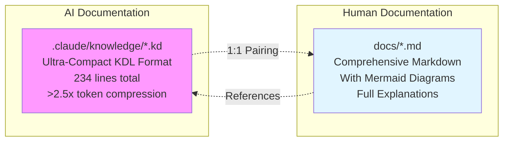
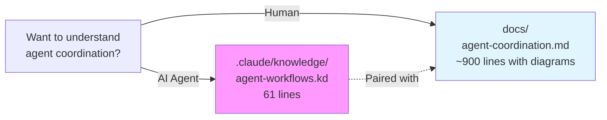
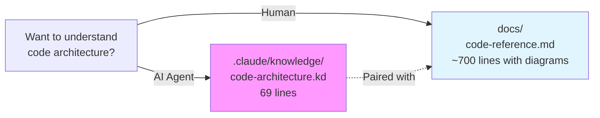
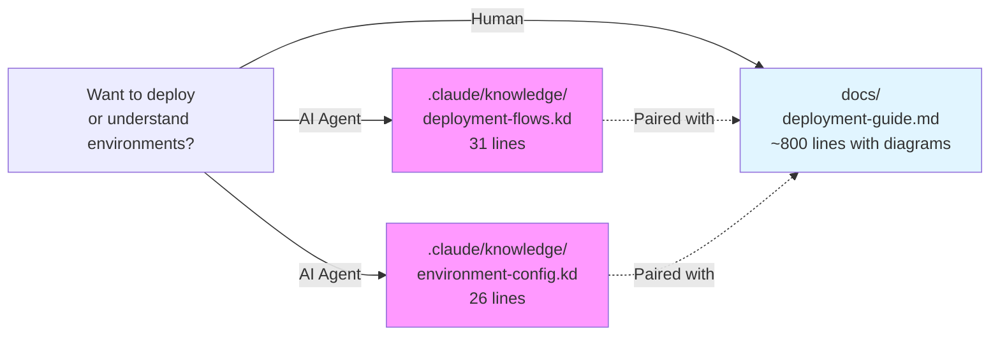
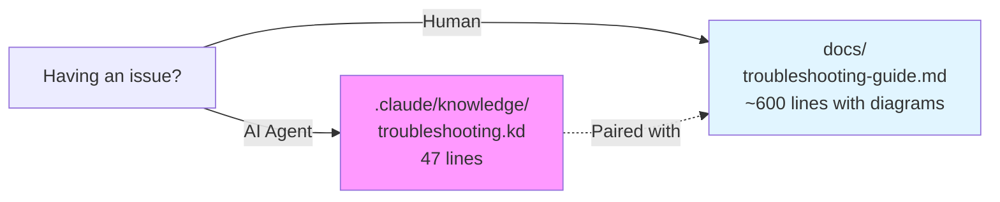

# Documentation Index

**Version**: 1.0
**Last Updated**: 2025-11-18

---

## Overview

This project uses a **dual-format documentation system** optimized for both AI agents (token-efficient) and humans (comprehensive with diagrams).

---

## Quick Navigation

### By Role

| I am a... | Start with... |
|-----------|---------------|
| **AI Agent** | Read `.claude/knowledge/*.kd` files for token-efficient knowledge |
| **Human Developer** | Read `docs/*.md` files with diagrams and explanations |
| **New to Project** | Start with `README.md` → `QUICK_START.md` → `docs/INDEX.md` (this file) |
| **Troubleshooting** | Go directly to `docs/troubleshooting-guide.md` |
| **Deploying** | Read `docs/deployment-guide.md` |

### By Task

| I want to... | Read... |
|--------------|---------|
| **Understand agent coordination** | `docs/agent-coordination.md` |
| **Learn code architecture** | `docs/code-reference.md` |
| **Deploy to Test/Production Pi** | `docs/deployment-guide.md` |
| **Fix an issue** | `docs/troubleshooting-guide.md` |
| **Write new code** | `docs/development-guide.md` |
| **Understand KDL format** | `.claude/knowledge/_schema.md` |

---

## Documentation Structure

### For AI Agents (Token-Optimized)

**Location**: `.claude/knowledge/`

| File | Lines | Purpose | Paired With |
|------|-------|---------|-------------|
| `_schema.md` | 428 | KDL syntax specification | N/A |
| `agent-workflows.kd` | 61 | Agent coordination, BLOCKING protocol, GitScrum | `docs/agent-coordination.md` |
| `code-architecture.kd` | 69 | Python modules, Pi-hole resources, services | `docs/code-reference.md` |
| `deployment-flows.kd` | 31 | Deployment procedures, sprint tracking | `docs/deployment-guide.md` |
| `environment-config.kd` | 26 | Environment tiers, autonomy rules | `docs/deployment-guide.md` |
| `troubleshooting.kd` | 47 | Known issues and resolutions | `docs/troubleshooting-guide.md` |

**Total**: 234 lines of ultra-compact knowledge (excluding schema)

**Token Efficiency**: >2.5x compression vs markdown while maintaining semantic completeness

---

### For Humans (Comprehensive with Diagrams)

**Location**: `docs/`

#### Core Documentation (NEW - With Mermaid Diagrams)

| File | Size | Purpose | Paired KDL |
|------|------|---------|------------|
| **agent-coordination.md** | ~900 lines | Agent workflows, BLOCKING protocol, GitScrum sprints, quality gates | `agent-workflows.kd` |
| **code-reference.md** | ~700 lines | Code architecture, module dependencies, SSH patterns, database schema | `code-architecture.kd` |
| **deployment-guide.md** | ~800 lines | Deployment flows, environment tiers, rollback procedures, sprint timelines | `deployment-flows.kd`, `environment-config.kd` |
| **troubleshooting-guide.md** | ~600 lines | Diagnostic trees, resolution procedures, common errors | `troubleshooting.kd` |

**Mermaid Diagram Count**: 35+ diagrams across all files

#### Legacy Documentation

| File | Size | Purpose | Status |
|------|------|---------|--------|
| `architecture.md` | 677 lines | System architecture overview | Active |
| `development-guide.md` | 1,053 lines | Python standards, coding patterns | Active |
| `deployment-procedures.md` | 656 lines | Environment-specific deployment | Superseded by `deployment-guide.md` |
| `environment-config.md` | 399 lines | Environment configurations | Superseded by `deployment-guide.md` |
| `agent-workflows.md` | 727 lines | Multi-agent workflows (text-only) | Superseded by `agent-coordination.md` |
| `troubleshooting.md` | 469 lines | Common issues (text-only) | Superseded by `troubleshooting-guide.md` |

---

## Root-Level Documentation

| File | Purpose | Audience |
|------|---------|----------|
| `README.md` | Project overview, features, prerequisites | Everyone (entry point) |
| `QUICK_START.md` | 5-minute setup guide | New users |
| `CLAUDE.md` | AI agent coordination guide (MINIMIZED) | AI agents |
| `SETUP_GUIDE.md` | Detailed setup instructions | Users setting up for first time |
| `PROJECT_SUMMARY.md` | Project structure summary | Developers |
| `PROGRESS.md` | Implementation status tracker | Project managers |

---

## Documentation Map by Topic

### Agent Coordination

**Topics Covered**:
- Agent roles and responsibilities
- BLOCKING protocol (step-by-step)
- GitScrum sprint workflow
- Feature development workflow
- Bug fix workflow
- Deployment coordination
- Quality gates
- Communication patterns

---

### Code Architecture

**Topics Covered**:
- System architecture
- Module dependency graph
- SSH communication patterns
- Pi-hole database schema
- Blocklist profile system
- Content filter rule engine
- Router integration
- State persistence
- Critical code patterns

---

### Deployment

**Topics Covered**:
- Environment tiers (Dev, Test Pi, Production Pi)
- Agent autonomy by environment
- Deployment flow end-to-end
- Rollback procedures
- Health check procedures
- Sprint-based deployment
- Safety mechanisms
- Deployment checklist

---

### Troubleshooting

**Topics Covered**:
- Quick diagnostic tree
- SSH issues (5 common issues)
- Pi-hole issues (6 common issues)
- Python issues (4 common issues)
- Deployment issues (4 common issues)
- Router issues (3 common issues)
- Content filter issues (2 common issues)
- Backup/restore issues
- Network issues
- Diagnostic commands reference

---

## File Pairing Reference

Every `.kd` file has a corresponding `.md` file:

| KDL File (Compact) | Markdown File (Comprehensive) | Line Ratio |
|--------------------|-------------------------------|------------|
| `agent-workflows.kd` (61 lines) | `agent-coordination.md` (~900 lines) | 1:15 |
| `code-architecture.kd` (69 lines) | `code-reference.md` (~700 lines) | 1:10 |
| `deployment-flows.kd` (31 lines) | `deployment-guide.md` (~800 lines) | 1:26 |
| `environment-config.kd` (26 lines) | `deployment-guide.md` (~800 lines) | 1:31 |
| `troubleshooting.kd` (47 lines) | `troubleshooting-guide.md` (~600 lines) | 1:13 |

**Average Compression**: 1:19 (19x more detail in markdown files)

---

## Mermaid Diagram Catalog

### Agent Coordination (agent-coordination.md)

1. Agent Roles and Responsibilities
2. BLOCKING Protocol Sequence
3. GitScrum Sprint Workflow Phases
4. Sprint Planning Flowchart
5. Sprint Implementation Flowchart
6. Sprint Review Flowchart
7. Sprint Retrospective Flowchart
8. Feature Development Workflow
9. Bug Fix Workflow
10. Deployment Coordination Graph
11. Deployment Flow Sequence Diagram
12. Agent Communication Patterns
13. Quality Gates Flowchart
14. Knowledge Base Update Flowchart

### Code Reference (code-reference.md)

1. System Architecture
2. Module Dependency Graph
3. Pi-Setup Module Flow
4. SSH Communication Sequence
5. Pi-hole Database ERD
6. Blocklist Profile System Flow
7. Content Filter Rule Engine
8. Router Integration Sequence
9. State Persistence Graph
10. Service Dependencies Graph
11. Management Module Pattern
12. UI Component Hierarchy
13. Import Graph

### Deployment Guide (deployment-guide.md)

1. Environment Tiers Graph
2. Deployment Flow End-to-End
3. Agent Autonomy by Environment
4. Local Development Deployment
5. Test Pi Deployment Sequence
6. Production Pi Deployment Sequence
7. Rollback Procedures Flowchart
8. Health Check Procedures
9. Sprint Deployment Gantt Chart
10. Safety Mechanisms Flow

### Troubleshooting Guide (troubleshooting-guide.md)

1. Quick Diagnostic Tree
2. SSH Connection Troubleshooting
3. DNS Failure Troubleshooting
4. Python Error Troubleshooting
5. Deployment Failure Troubleshooting
6. Router Connection Troubleshooting
7. Content Filter Troubleshooting
8. Backup Failure Troubleshooting
9. Network Troubleshooting

**Total Mermaid Diagrams**: 36

---

## Documentation Philosophy

### Dual-Format System Benefits

**For AI Agents** (.kd files):
- ✅ Ultra-compact (234 lines total)
- ✅ >2.5x token compression
- ✅ Fits in context windows
- ✅ Machine-readable structure
- ✅ Fast parsing and validation

**For Humans** (.md files):
- ✅ Comprehensive explanations
- ✅ Visual Mermaid diagrams
- ✅ Step-by-step procedures
- ✅ Examples and code snippets
- ✅ No token constraints

### Why Not Choose One Format?

**Markdown alone**: Too verbose for AI context windows (>3000 lines)
**KDL alone**: Too terse for human understanding (lacks explanations)

**Solution**: 1:1 pairing - best of both worlds!

---

## Maintenance Guidelines

### Updating Documentation

When updating knowledge, update BOTH files:

1. **Update .kd file** (via Knowledge Manager BLOCKING protocol)
   - Ultra-compact KDL format
   - One line per entry
   - Validate syntax

2. **Update .md file** (manually)
   - Comprehensive explanations
   - Update diagrams if needed
   - Add examples

3. **Keep them synchronized**
   - Same facts in both files
   - Different levels of detail
   - Cross-reference each other

### Adding New Documentation

1. Determine category (agent-workflows, code-architecture, deployment, troubleshooting)
2. Add KDL entry to appropriate .kd file
3. Add comprehensive section to paired .md file
4. Update this INDEX.md if needed

---

## Quick Reference by Scenario

### Scenario: New AI Agent Joins Project

**Path**:
1. Read `CLAUDE.md` (quick overview)
2. Read `.claude/knowledge/_schema.md` (KDL syntax)
3. Read `.claude/knowledge/agent-workflows.kd` (coordination)
4. Read `.claude/knowledge/code-architecture.kd` (codebase)
5. Ready to contribute!

**Time**: ~5 minutes to load all knowledge

---

### Scenario: New Human Developer Joins Project

**Path**:
1. Read `README.md` (project overview)
2. Read `QUICK_START.md` (setup)
3. Read `docs/agent-coordination.md` (how agents work)
4. Read `docs/code-reference.md` (codebase architecture)
5. Read `docs/development-guide.md` (coding standards)
6. Ready to contribute!

**Time**: ~30-60 minutes comprehensive understanding

---

### Scenario: Production Issue Needs Resolution

**Path**:
1. Check `docs/troubleshooting-guide.md` (diagnostic trees)
2. Follow decision tree for issue category
3. Execute resolution procedure
4. If issue resolved: Update `.claude/knowledge/troubleshooting.kd` + `docs/troubleshooting-guide.md`

**Time**: 5-30 minutes depending on issue

---

### Scenario: Deploying to Production Pi

**Path**:
1. Review `docs/deployment-guide.md` (deployment flow)
2. Follow deployment checklist
3. Request user approval (mandatory gate)
4. Execute deployment with backup
5. Run health checks
6. Monitor for stability

**Time**: 15-30 minutes

---

## File Size Comparison

| Format | Total Size | Files | Average per File |
|--------|------------|-------|------------------|
| **KDL** | ~15 KB | 5 files | 3 KB |
| **Markdown** | ~250 KB | 4 new files + 7 legacy | 25 KB |

**Storage**: Minimal impact (~265 KB total)
**Token Impact**: Massive savings (KDL: ~3K tokens vs Markdown: ~75K tokens)

---

## Future Documentation Plans

- [ ] Consolidate SETUP_GUIDE.md duplicates
- [ ] Move PROJECT_SUMMARY.md → `docs/PROJECT_STRUCTURE.md`
- [ ] Move PROGRESS.md → `docs/DEVELOPMENT_STATUS.md`
- [ ] Create `docs/KNOWLEDGE_BASE_MAPPING.md` (KDL ↔ MD cross-reference)
- [ ] Add `.claude/knowledge/README.md` explaining KDL benefits

---

## Getting Help

**Questions about documentation**:
- Check this INDEX.md first
- Refer to appropriate .md file with diagrams
- For AI agents: check corresponding .kd file

**Contributing documentation**:
- Update both .kd and .md files (1:1 pairing)
- Use Mermaid diagrams for complex flows
- Follow KDL schema syntax
- Use BLOCKING protocol for .kd updates

---

## Summary

This project's documentation system:

- **Dual-format**: KDL (compact) + Markdown (comprehensive)
- **1:1 pairing**: Every .kd has a paired .md file
- **Visual**: 36 Mermaid diagrams across documentation
- **Token-optimized**: 234 lines of KDL vs 3000+ lines of markdown
- **Role-based**: AI agents use .kd, humans use .md
- **Comprehensive**: Covers workflows, architecture, deployment, troubleshooting

**Start here**: This INDEX.md → Navigate to specific topic → Read appropriate file format for your role (AI or human)
