# Agent Coordination and Workflows

**Version**: 1.0
**Last Updated**: 2025-11-18
**Paired KDL**: `.claude/knowledge/agent-workflows.kd`

---

## Overview

The Pi-hole Network Manager uses a **multi-agent development system** where specialized AI agents coordinate through structured workflows. This document visualizes how agents interact, coordinate through the BLOCKING protocol, and execute GitScrum sprints.

---

## Agent Roles and Responsibilities

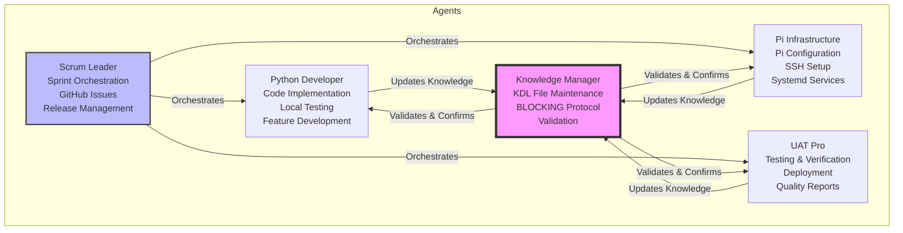

**Key Characteristics:**
- **Scrum Leader**: Central orchestrator, no blocking on its own actions
- **Knowledge Manager**: MANDATORY coordination point - enforces BLOCKING protocol
- **Python Developer**: Implements features, coordinates with Knowledge Manager
- **Pi Infrastructure**: Handles Pi-side configuration and services
- **UAT Pro**: Autonomous test execution, reports to Scrum Leader

---

## BLOCKING Protocol

The BLOCKING protocol ensures knowledge synchronization across all agents before proceeding with tasks.

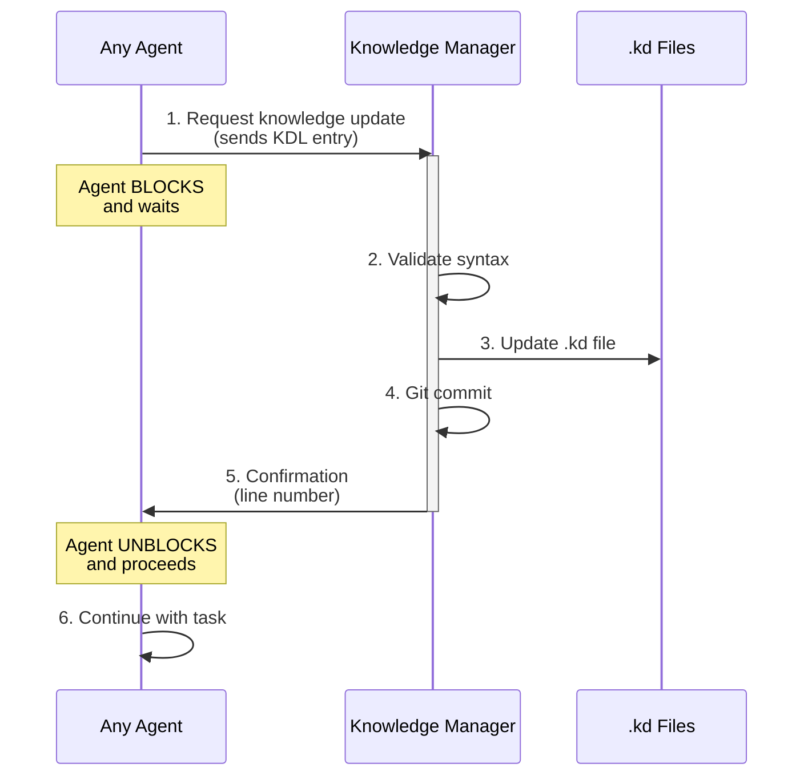

**Protocol Steps:**

1. **Request** - Agent sends KDL-formatted entry to Knowledge Manager
2. **Validate** - Knowledge Manager validates syntax against schema
3. **Update** - Knowledge Manager updates appropriate .kd file
4. **Commit** - Knowledge Manager commits change to git
5. **Confirm** - Knowledge Manager sends confirmation with line number
6. **Proceed** - Agent unblocks and continues execution

**Why BLOCKING?**
- Ensures all agents have synchronized knowledge
- Prevents drift between agent understanding and system reality
- Creates audit trail of knowledge changes
- Enforces validation before persistence

---

## GitScrum Sprint Workflow

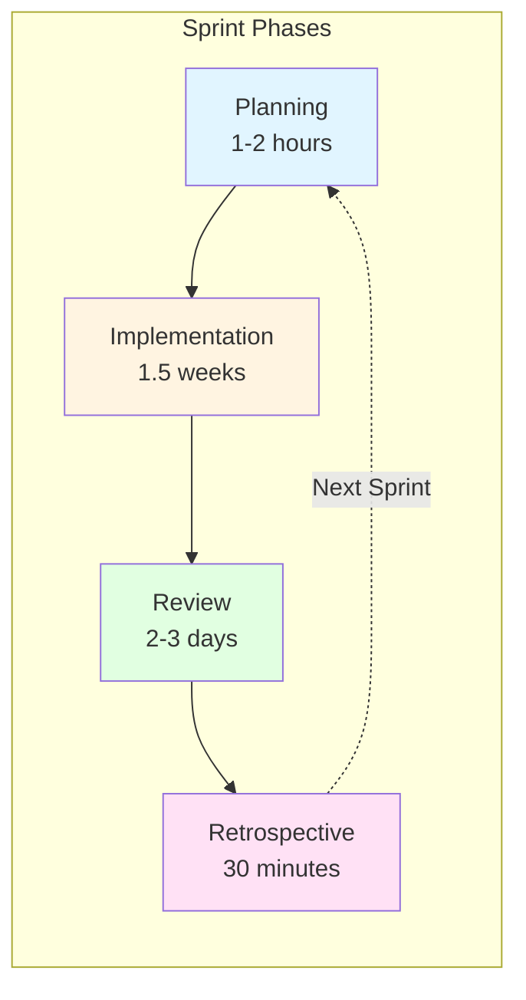

### Sprint Phase Details

#### 1. Planning (1-2 hours)

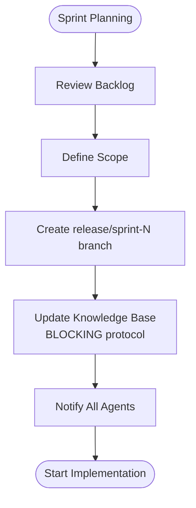

**Artifacts:**
- Sprint backlog (GitHub issues)
- Release branch (`release/sprint-N`)
- Updated `.claude/knowledge/deployment-flows.kd`

#### 2. Implementation (1.5 weeks)

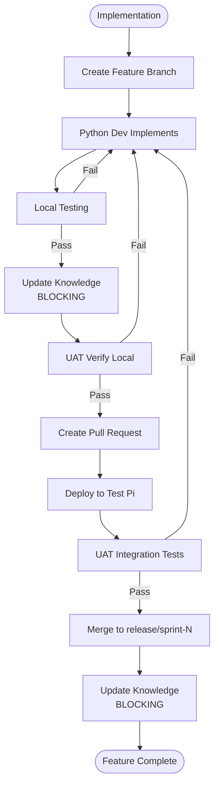

**Quality Gates:**
- ✅ Local tests pass
- ✅ Knowledge base updated
- ✅ UAT verification pass
- ✅ Test Pi integration pass

#### 3. Review (2-3 days)

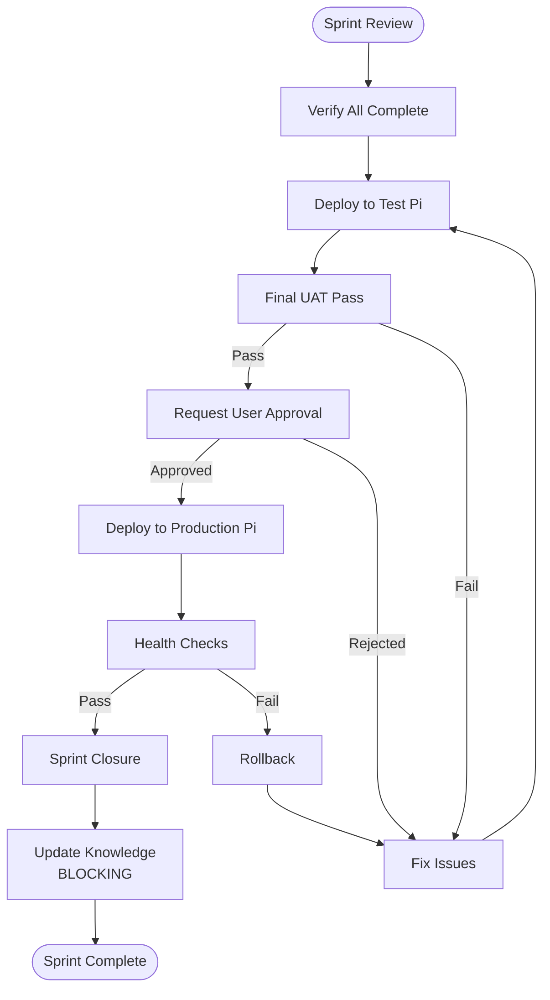

**Deliverables:**
- Production deployment
- Updated knowledge base
- Sprint metrics

#### 4. Retrospective (30 minutes)

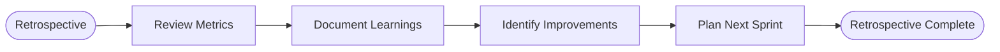

---

## Feature Development Workflow

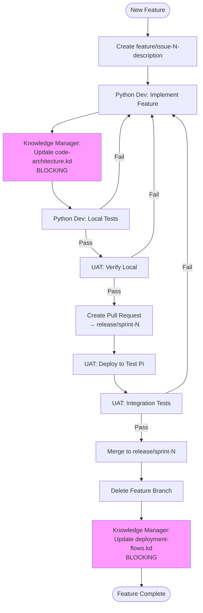

---

## Bug Fix Workflow

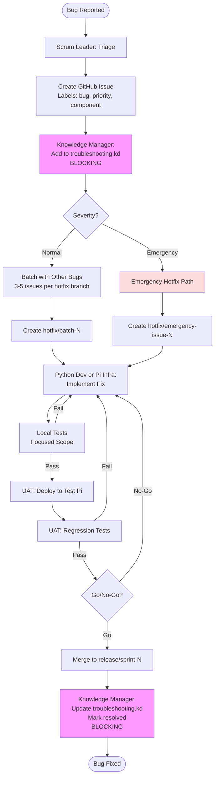

**Bug Batching Strategy:**
- Group 3-5 related bugs per hotfix branch
- Reduces context switching
- Easier regression testing
- More efficient PR reviews

**Emergency Hotfix Criteria:**
- Network-critical DNS failures
- Security vulnerabilities
- Complete service outages
- Data corruption risks

---

## Deployment Coordination

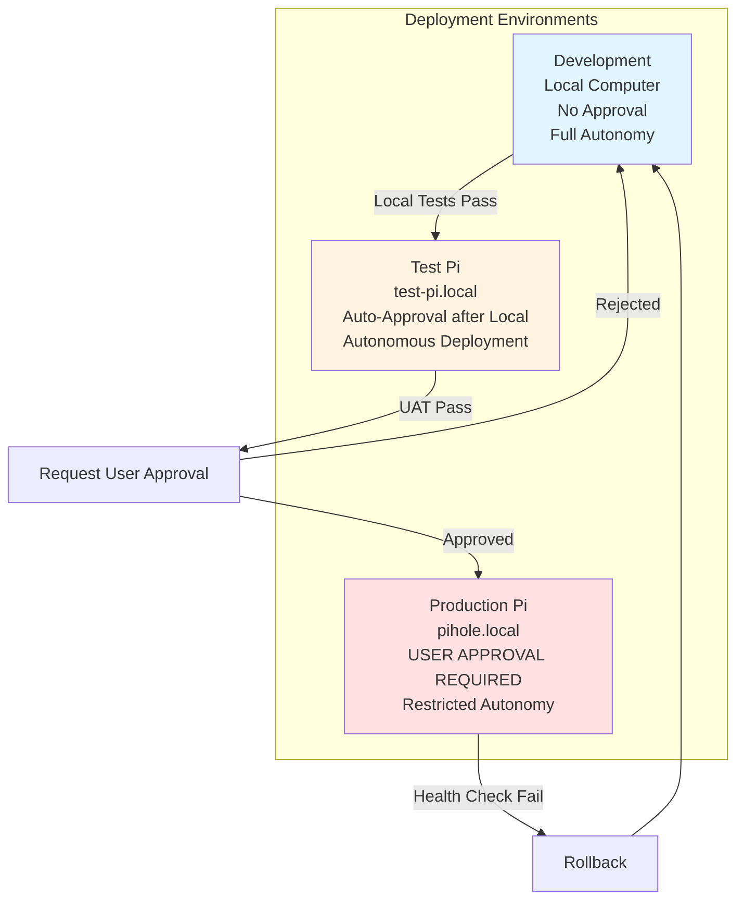

### Deployment Flow Details

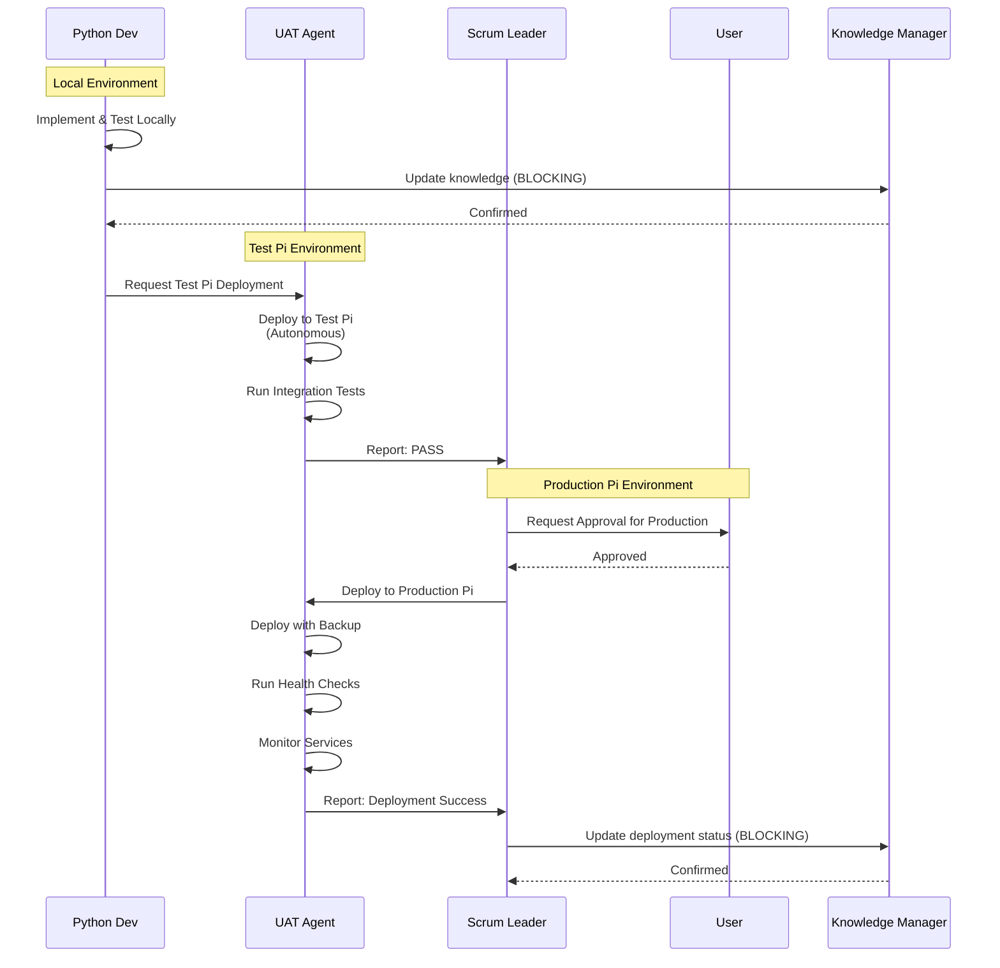

---

## Agent Communication Patterns

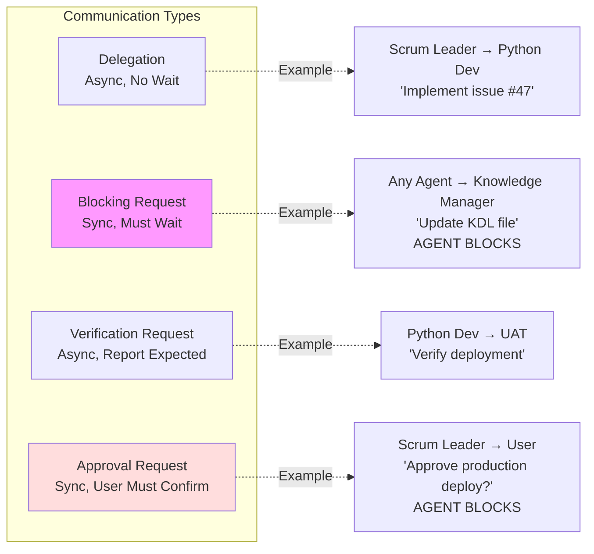

---

## Multi-Agent Coordination Matrix

| Workflow Type | Agents Involved | Sequence | Blocking Point |
|---------------|----------------|----------|----------------|
| **Feature Development** | Scrum Leader, Python Dev, UAT, Knowledge Manager | Sequential | Knowledge Manager |
| **Bug Fix** | Scrum Leader, Python/Pi Infra, UAT, Knowledge Manager | Sequential | Knowledge Manager |
| **Sprint Execution** | All Agents | Parallel within phase | Knowledge Manager (sync points) |
| **Deployment** | Scrum Leader, UAT, Knowledge Manager | Sequential | User Approval + Knowledge Manager |

---

## Quality Gates

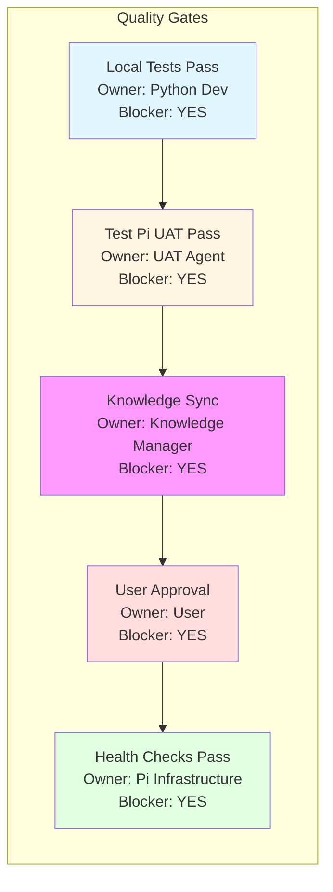

All quality gates are **BLOCKING** - workflow cannot proceed until gate passes.

---

## Knowledge Base Updates

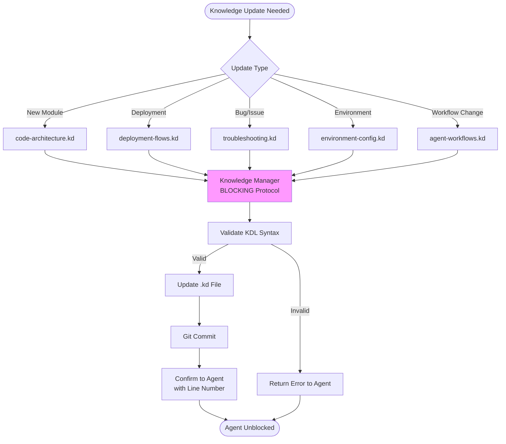

---

## Best Practices

### For Agents

1. **Always use BLOCKING protocol** when updating knowledge
2. **Wait for Knowledge Manager confirmation** before proceeding
3. **Include all required KDL attributes** in update requests
4. **Coordinate through Scrum Leader** for multi-agent tasks
5. **Report status** to appropriate agents (UAT → Scrum Leader, Python Dev → Knowledge Manager)

### For Knowledge Manager

1. **Validate ALL KDL syntax** before updates
2. **Commit changes immediately** after validation
3. **Confirm with line numbers** so agents can reference
4. **Reject invalid entries** with clear error messages
5. **Maintain .kd ↔ .md pairing** (update both when needed)

### For Scrum Leader

1. **Orchestrate, don't implement** - delegate to specialized agents
2. **Coordinate approval requests** for production deployments
3. **Track sprint progress** via GitHub issues
4. **Facilitate retrospectives** and document learnings
5. **Monitor quality gates** and escalate blockers

---

## References

- **KDL Schema**: `.claude/knowledge/_schema.md`
- **KDL File**: `.claude/knowledge/agent-workflows.kd`
- **Deployment Procedures**: `docs/deployment-procedures.md`
- **Environment Configuration**: `docs/environment-config.md`

---

## Glossary

- **BLOCKING Protocol**: Synchronous coordination mechanism requiring Knowledge Manager confirmation
- **GitScrum**: Agile methodology using Git branches + Scrum sprints
- **Quality Gate**: Required checkpoint that must pass before proceeding
- **KDL**: Knowledge Definition Language - ultra-compact knowledge encoding format
- **UAT**: User Acceptance Testing - integration and verification testing
