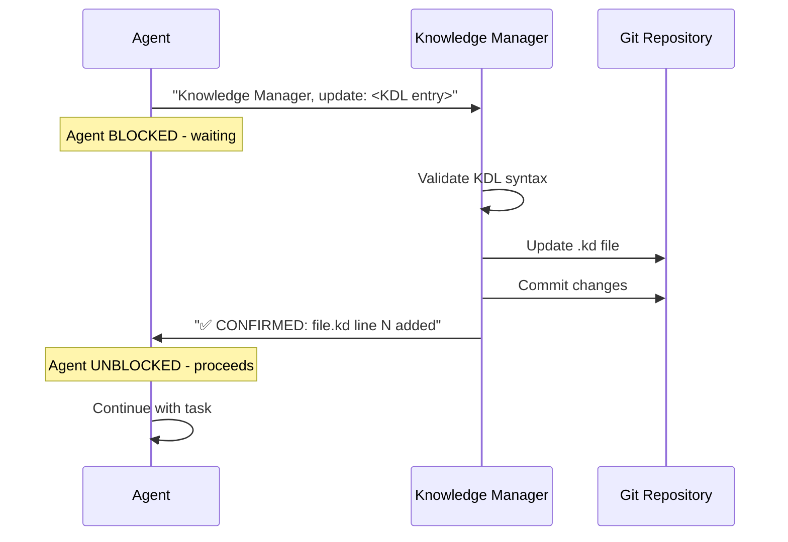

# Agent Workflows

**Version**: 1.0
**Last Updated**: 2025-01-18
**Purpose**: Comprehensive guide to multi-agent coordination workflows for Pi-hole Network Manager development

---

## Table of Contents

1. [Overview](#overview)
2. [Agent Roles](#agent-roles)
3. [Blocking Coordination Protocol](#blocking-coordination-protocol)
4. [Sprint-Based Development](#sprint-based-development)
5. [Feature Development Workflow](#feature-development-workflow)
6. [Bug Fix Workflow](#bug-fix-workflow)
7. [Deployment Coordination](#deployment-coordination)
8. [Quality Gates](#quality-gates)
9. [Communication Patterns](#communication-patterns)
10. [Troubleshooting](#troubleshooting)

---

## Overview

The Pi-hole Network Manager project uses a multi-agent system coordinated by the **Pi-hole Scrum Leader** agent. All agents follow structured workflows with clear handoffs, blocking protocols, and quality gates.

### Core Principles

1. **Orchestration, not implementation** - Scrum Leader delegates technical work
2. **Blocking coordination** - Knowledge Manager blocks agents until knowledge base is updated
3. **Environment-based autonomy** - Different approval rules for Dev/Test Pi/Production Pi
4. **Quality gates** - No bypassing UAT or knowledge synchronization
5. **Clear communication** - Structured patterns for agent-to-agent coordination

### Agent Ecosystem

```
┌─────────────────────────────────────────────────────────────┐
│                   Pi-hole Scrum Leader                      │
│              (Orchestrates all workflows)                   │
└────────────────────────┬────────────────────────────────────┘
                         │
         ┌───────────────┼───────────────┬──────────────┐
         │               │               │              │
    ┌────▼────┐   ┌──────▼──────┐  ┌────▼────┐  ┌─────▼──────┐
    │ Python  │   │     Pi      │  │   UAT   │  │ Knowledge  │
    │Developer│   │Infrastructure│  │   Pro   │  │  Manager   │
    └─────────┘   └─────────────┘  └─────────┘  └─────┬──────┘
                                                        │
                                            (BLOCKING - all agents wait)
```

---

## Agent Roles

### Pi-hole Scrum Leader

**Responsibilities**:
- Sprint planning and backlog management
- GitHub Issue creation and tracking
- Release coordination (Dev → Test Pi → Production Pi)
- Agent delegation and coordination
- Approval requests for Production Pi deployments

**Does NOT**:
- Write code (delegates to Python Developer)
- Configure Pi directly (delegates to Pi Infrastructure)
- Run tests manually (delegates to UAT)

**Key Pattern**:
```
Scrum Leader: "Python Developer, implement Issue #47..."
[Wait for completion]
Python Developer: "✅ Implementation complete"
Scrum Leader: "UAT Agent, verify Issue #47 on test-pi.local..."
```

### Knowledge Manager (BLOCKING Protocol)

**Responsibilities**:
- Maintain .kd knowledge base files
- Validate and commit all knowledge updates
- Block requesting agents until confirmation
- Enforce CLAUDE.md token budget
- Ensure .kd/.md file pairing

**Blocking Pattern**:
```
1. Agent: "Knowledge Manager, update: <KDL entry>"
2. Knowledge Manager: [Validates → Updates → Commits]
3. Knowledge Manager: "✅ CONFIRMED: code-architecture.kd line 87 added"
4. Agent: [Proceeds with task]
```

**Critical**: Agents CANNOT proceed without Knowledge Manager confirmation.

### Python Developer

**Responsibilities**:
- Implement features and bug fixes
- Write Python code following project patterns
- Local testing (unit tests, no Pi required)
- Update Knowledge Manager with code changes

**Workflow**:
```
1. Receive task from Scrum Leader
2. Implement on feature branch
3. Test locally (Python execution)
4. Notify Knowledge Manager of changes
5. Report completion to Scrum Leader
```

### Pi Infrastructure

**Responsibilities**:
- Configure Raspberry Pi OS
- Set up systemd services
- Manage SSH configurations
- Pi-hole installation and configuration
- Health checks and diagnostics

**Workflow**:
```
1. Receive configuration task
2. Execute via SSH on target Pi
3. Verify configuration
4. Update Knowledge Manager
5. Report completion
```

### UAT Pro

**Responsibilities**:
- Autonomous testing (no user intervention for script execution)
- Deploy to Test Pi via SSH
- Verify acceptance criteria
- Report PASS/FAIL with evidence
- Regression testing

**Autonomy**:
- Runs SSH deployments automatically
- Executes health checks autonomously
- Provides test evidence (logs, status outputs)

---

## Blocking Coordination Protocol

### Overview

The Knowledge Manager uses a **blocking protocol** - agents MUST wait for confirmation before proceeding. This ensures the knowledge base is always synchronized.

### Protocol Steps



### Example: Feature Implementation

```
Python Developer: "Knowledge Manager, update:
python::module::mgmt-scheduler:management/scheduler.py|features:cron-jobs,blocklist-automation|imports:ssh_client"

[Python Developer BLOCKED - cannot proceed until confirmed]

Knowledge Manager:
1. Validates syntax ✓
2. Adds to code-architecture.kd line 34
3. Commits: "Add scheduler module to architecture"
4. Responds: "✅ CONFIRMED: code-architecture.kd line 34 added"

[Python Developer UNBLOCKED]

Python Developer: "✅ Implementation complete for scheduler module"
```

### Anti-Pattern (DON'T DO)

❌ **Agent proceeds without waiting**:
```
Agent: "Knowledge Manager, update: ..."
Agent: [Immediately proceeds without confirmation]
```

**Why wrong**: Knowledge base and code become desynchronized. Historical tracking lost.

✅ **Correct**:
```
Agent: "Knowledge Manager, update: ..."
[WAIT for confirmation]
Knowledge Manager: "✅ CONFIRMED: ..."
Agent: [Now proceeds]
```

---

## Sprint-Based Development

### Sprint Lifecycle

```
┌──────────────┐     ┌──────────────────┐     ┌─────────────┐     ┌──────────────┐
│   Planning   │────▶│  Implementation  │────▶│   Review &  │────▶│Retrospective │
│   (1-2h)     │     │   (1.5 weeks)    │     │Release(2-3d)│     │   (30min)    │
└──────────────┘     └──────────────────┘     └─────────────┘     └──────────────┘
```

### Phase 1: Sprint Planning

**Duration**: 1-2 hours

**Steps**:

1. **Review Backlog**
   ```
   Scrum Leader uses GitHub MCP:
   - list_issues(state="OPEN", labels=["backlog"])
   - Triage new bugs and features
   - Prioritize by impact/effort
   ```

2. **Define Sprint Scope**
   ```
   - Select 3-5 issues for sprint
   - Label issues with "sprint-N"
   - Create GitHub Milestone
   - Estimate effort (S/M/L)
   ```

3. **Create Sprint Branch**
   ```bash
   git checkout main
   git pull origin main
   git checkout -b release/sprint-N
   git push origin release/sprint-N
   ```

4. **Update Knowledge Manager** (BLOCKING)
   ```
   Scrum Leader: "Knowledge Manager, add to deployment-flows.kd:
   deploy::sprint::sprint-N:release/sprint-N|start-date:YYYY-MM-DD|issues:#X,#Y,#Z|status:planned|duration:2-weeks"

   [WAIT for confirmation]

   Knowledge Manager: "✅ CONFIRMED: deployment-flows.kd line 48 added"
   ```

5. **Notify Agents**
   ```
   - Python Developer: "Sprint N started, issues assigned"
   - Pi Infrastructure: "Prepare Test Pi for Sprint N testing"
   - UAT Agent: "Sprint N testing begins <date>"
   ```

### Phase 2: Implementation

**Duration**: 1.5 weeks (days 1-10)

**For Each Issue**:

1. **Create Feature Branch**
   ```
   Scrum Leader uses GitHub MCP:
   create_branch(
     branch="feature/<issue-number>-<description>",
     from_branch="main"
   )
   ```

2. **Delegate to Python Developer**
   ```
   Scrum Leader: "Python Developer, implement Issue #47 on branch feature/47-blocklist-scheduling.

   Acceptance criteria:
   - Users can schedule blocklist profile switches
   - Cron jobs created on Pi via SSH
   - Schedule can be edited/deleted

   Please test locally and notify when complete."
   ```

3. **Python Developer Implementation**
   ```
   Python Developer:
   1. Implements feature
   2. Tests locally (no Pi needed)
   3. Updates Knowledge Manager:
      "Knowledge Manager, update:
      python::module::mgmt-scheduler:management/scheduler.py|features:cron,profile-switch|imports:ssh_client"
   4. Reports: "✅ Implementation complete for Issue #47"
   ```

4. **UAT Verification (Test Pi)**
   ```
   Scrum Leader: "UAT Agent, verify Issue #47 on test-pi.local.

   Expected behavior:
   - Scheduled profile switch executes via cron
   - Gravity rebuild occurs after switch
   - Pi-hole service remains stable

   Please deploy via SSH, test, and report results."

   UAT Agent:
   1. SSH deploys to test-pi.local (autonomous)
   2. Tests all acceptance criteria
   3. Reports: "✅ PASS: Issue #47 verified on test-pi.local.
      Evidence:
      - Cron job created successfully ✓
      - Profile switched at scheduled time ✓
      - Gravity rebuild completed ✓"
   ```

5. **Create Pull Request**
   ```
   Scrum Leader uses GitHub MCP:
   create_pull_request(
     title="Issue #47: Add blocklist scheduling",
     head="feature/47-blocklist-scheduling",
     base="release/sprint-N",
     body="Closes #47\n\nUAT Evidence:\n- Test Pi verification passed\n- All acceptance criteria met"
   )
   ```

6. **Merge to Release Branch**
   ```bash
   git checkout release/sprint-N
   git merge --no-ff feature/47-blocklist-scheduling -m "Merge Issue #47"
   git push origin release/sprint-N
   ```

### Phase 3: Review & Release

**Duration**: 2-3 days (days 11-14)

**Steps**:

1. **Verify All Issues Complete**
   ```
   Scrum Leader uses GitHub MCP:
   list_issues(labels=["sprint-N"], state="OPEN")

   If any open: Coordinate with agents to complete or move to next sprint
   If all closed: Proceed to release
   ```

2. **Deploy to Test Pi**
   ```
   Scrum Leader: "UAT Agent, deploy release/sprint-N to test-pi.local via SSH."

   UAT Agent: [Deploys autonomously via SSH]
   ```

3. **Final UAT Verification**
   ```
   Scrum Leader: "UAT Agent, perform full regression testing on test-pi.local for Sprint N.

   Test all closed issues:
   - Issue #47: Blocklist scheduling
   - Issue #52: Device grouping
   - Issue #58: Router control

   Verify no regressions in existing features."

   UAT Agent: [Autonomous testing]
   UAT Agent: "✅ PASS: Sprint N verified on test-pi.local. All issues working, no regressions detected."
   ```

4. **Update Knowledge Manager** (BLOCKING)
   ```
   Scrum Leader: "Knowledge Manager, update deployment-flows.kd:
   deploy::sprint::sprint-N:release/sprint-N|status:test-pi-verified|uat:PASS|ready:prod-pi"

   Knowledge Manager: "✅ CONFIRMED: deployment-flows.kd line 48 modified"
   ```

5. **Request Production Approval**
   ```
   Scrum Leader: "@user: Sprint N is ready for Production Pi deployment.

   Sprint Summary:
   - Issues closed: #47, #52, #58
   - UAT Status: PASS (test-pi.local verification complete)
   - Deployment target: pihole.local (Production Pi)

   Release notes:
   - Blocklist scheduling added
   - Device grouping improved
   - Router control enhanced

   Approve Production Pi deployment? (yes/no)"
   ```

6. **Deploy to Production Pi** (after approval)
   ```
   Scrum Leader: "Deploying Sprint N to Production Pi...

   1. Merge release/sprint-N to main branch
   2. SSH deploy to pihole.local
   3. Monitor deployment
   4. Coordinate health checks with Pi Infrastructure"

   Pi Infrastructure: "✅ Health checks passed:
   - Pi-hole FTL: active
   - DNS resolution: working
   - Query blocking: functional
   - System resources: normal"
   ```

7. **Sprint Closure**
   ```
   - Close GitHub Milestone
   - Update Knowledge Manager with final status
   - Archive release branch
   - Generate retrospective notes
   ```

### Phase 4: Retrospective

**Duration**: 30 minutes

**Focus Areas**:
- Issues planned vs. completed
- Bugs discovered during sprint
- Deployment issues or rollbacks
- Agent coordination effectiveness
- Improvements for next sprint

---

## Feature Development Workflow

### Step-by-Step Process

1. **GitHub Issue Creation**
   ```
   Scrum Leader creates issue:
   - Title: Clear, descriptive
   - Labels: feature, sprint-N, priority:medium, component:pihole
   - Acceptance criteria: Testable requirements
   - Related issues: Dependencies
   ```

2. **Knowledge Sync** (BLOCKING)
   ```
   Scrum Leader: "Knowledge Manager, sync Issue #61 to troubleshooting.kd if bug-related,
   or track in deployment-flows.kd if feature"
   ```

3. **Feature Branch**
   ```bash
   git checkout main
   git checkout -b feature/61-router-bandwidth-stats
   git push origin feature/61-router-bandwidth-stats
   ```

4. **Implementation**
   ```
   Scrum Leader delegates:
   "Python Developer, implement Issue #61 on feature/61-router-bandwidth-stats..."

   Python Developer implements, tests locally, updates Knowledge Manager
   ```

5. **Local UAT** (optional for complex features)
   ```
   UAT Agent verifies on local/mock environment before Test Pi deployment
   ```

6. **Test Pi Deployment**
   ```
   Scrum Leader: "UAT Agent, verify Issue #61 on test-pi.local..."

   UAT Agent: Autonomous SSH deployment and testing
   ```

7. **Pull Request**
   ```
   Create PR with UAT evidence
   Merge to release branch after review
   ```

---

## Bug Fix Workflow

### Triage

```
1. User reports bug or UAT discovers issue
2. Scrum Leader creates GitHub Issue
3. Assign severity: critical/high/medium/low
4. Assign component: ssh, pihole, python, router
5. Sync to troubleshooting.kd (BLOCKING)
```

### Example: Bug Triage

```
Scrum Leader creates Issue #71:
Title: "Blocklist update causes DNS downtime"
Labels: bug, priority:high, component:pihole

Scrum Leader: "Knowledge Manager, add to troubleshooting.kd:
issue::pihole::blocklist-update-downtime:gravity-rebuild-dns-failure|cause:service-restart-not-graceful|fix:reload-not-restart|severity:high|github-issue:#71"

Knowledge Manager: "✅ CONFIRMED: troubleshooting.kd line 23 added"
```

### Batched Bug Fixes

**When**: Multiple non-critical bugs accumulate

**Process**:
1. Create hotfix branch: `hotfix/batch-YYYY-MM-DD`
2. For each bug:
   - Create feature branch
   - Implement fix
   - Verify on Test Pi
   - Merge to hotfix branch
3. Deploy hotfix batch to Test Pi
4. Final UAT verification
5. Request approval for Production Pi
6. Deploy to Production Pi

### Emergency Hotfix

**When**: Critical Production Pi issue

**Expedited Process**:
1. Assess impact (Sequential Thinking)
2. Create hotfix issue and branch immediately
3. Expedited implementation (Python Developer URGENT)
4. Minimal UAT (critical tests only on Test Pi)
5. Direct to Production Pi (skip full regression)
6. Post-deployment monitoring
7. Full regression testing after deployment

---

## Deployment Coordination

### Environment-Based Deployment

```
┌──────────────┐     ┌──────────────┐     ┌──────────────────┐
│      Dev     │────▶│   Test Pi    │────▶│  Production Pi   │
│   (Local)    │     │(test-pi.local│     │  (pihole.local)  │
│              │     │              │     │                  │
│ Approval:    │     │ Approval:    │     │ Approval:        │
│   None       │     │   Auto after │     │   USER REQUIRED  │
│              │     │   local tests│     │                  │
└──────────────┘     └──────────────┘     └──────────────────┘
```

### Deployment Checklist

**Test Pi**:
- ✅ Local tests passed
- ✅ Knowledge Manager updated
- ✅ UAT autonomous deployment
- ✅ Health checks passed
- ✅ No approval needed (autonomous)

**Production Pi**:
- ✅ Test Pi verification complete
- ✅ UAT reports PASS
- ✅ Knowledge Manager status updated
- ✅ **User approval obtained**
- ✅ Health checks post-deployment
- ✅ Monitoring active

---

## Quality Gates

### Mandatory Gates

1. **Local Tests Pass** (Python Developer)
   - Blocker: Yes
   - Owner: Python Developer
   - Verification: Unit tests, local execution

2. **Test Pi UAT Pass** (UAT Agent)
   - Blocker: Yes
   - Owner: UAT Agent
   - Verification: Integration tests, acceptance criteria

3. **Knowledge Base Updated** (Knowledge Manager)
   - Blocker: Yes (BLOCKING protocol)
   - Owner: Knowledge Manager
   - Verification: Confirmation message received

4. **User Approval** (Production Pi only)
   - Blocker: Yes
   - Owner: User
   - Verification: Explicit yes/no response

5. **Health Checks Pass** (Pi Infrastructure)
   - Blocker: Yes (Production Pi)
   - Owner: Pi Infrastructure
   - Verification: DNS, services, resources all OK

### Gate Enforcement

❌ **Cannot bypass**:
- Knowledge Manager confirmation
- UAT verification on Test Pi
- User approval for Production Pi

✅ **Can skip** (emergency hotfix only):
- Full regression testing (reduced to critical tests)
- Test Pi deployment (direct to Production with monitoring)

---

## Communication Patterns

### Agent-to-Agent

**Delegation**:
```
Scrum Leader: "<Agent>, <action> for Issue #N on <branch>..."
Agent: [Performs work]
Agent: "✅ <Task> complete for Issue #N"
```

**Blocking Request**:
```
Agent: "Knowledge Manager, update: <KDL entry>"
[Agent WAITS]
Knowledge Manager: "✅ CONFIRMED: <file> line N <action>"
Agent: [Proceeds]
```

**Verification Request**:
```
Scrum Leader: "UAT Agent, verify Issue #N on <environment>..."
UAT Agent: [Tests autonomously]
UAT Agent: "✅ PASS: Issue #N verified" OR "❌ FAIL: Issue #N failed - <details>"
```

### Agent-to-User

**Approval Request**:
```
Scrum Leader: "@user: Sprint N ready for Production Pi deployment.
Summary: <details>
Approve? (yes/no)"

User: "yes"

Scrum Leader: "Deploying to Production Pi..."
```

---

## Troubleshooting

### "Agent Not Waiting for Confirmation"

**Symptom**: Agent proceeds before Knowledge Manager confirms

**Cause**: Agent skipped blocking protocol

**Fix**: Reinforce blocking protocol in agent instructions

### "UAT Won't Deploy Autonomously"

**Symptom**: UAT Agent waiting for permission to run SSH commands

**Cause**: UAT needs explicit "autonomous" instruction

**Fix**: Use clear language: "UAT Agent, deploy autonomously via SSH to test-pi.local..."

### "Knowledge Base Desynchronized"

**Symptom**: .kd files don't match code reality

**Cause**: Agent bypassed Knowledge Manager

**Fix**: Run drift detection, update .kd files, reinforce protocol

### "Production Deployment Approved But Failed"

**Symptom**: Deployment to Production Pi fails after approval

**Cause**: Infrastructure issue, network problem, or code error

**Fix**:
1. Assess impact (Sequential Thinking)
2. Coordinate with Pi Infrastructure for diagnostics
3. If critical: Initiate rollback
4. Document in troubleshooting.kd
5. Post-mortem analysis

---

## Summary

The agent workflow system ensures:

- ✅ **Clear ownership** - Each agent has defined responsibilities
- ✅ **Quality gates** - No bypassing UAT or knowledge sync
- ✅ **Blocking coordination** - Knowledge base always current
- ✅ **Environment safety** - Approval required for Production Pi
- ✅ **Autonomous testing** - UAT runs without manual intervention
- ✅ **Structured sprints** - Predictable 2-week cadence
- ✅ **Clear communication** - Standard patterns for coordination

**All agents follow these workflows to maintain code quality, deployment safety, and knowledge synchronization.**
