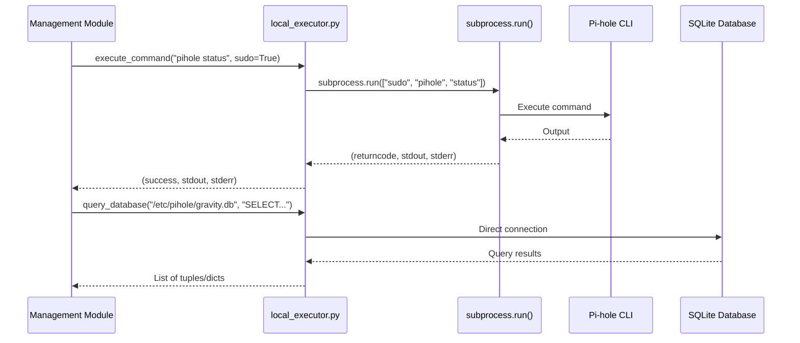
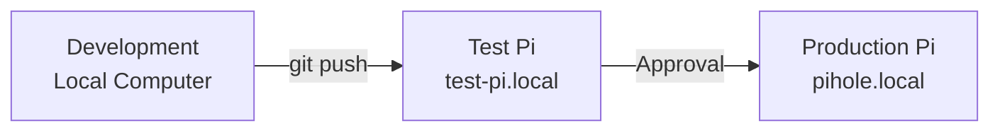
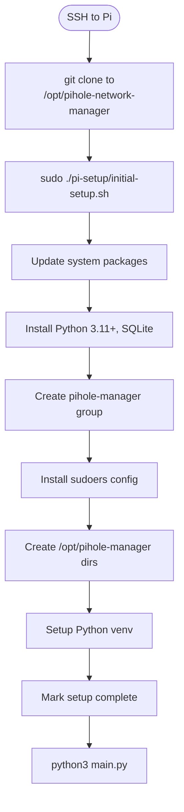
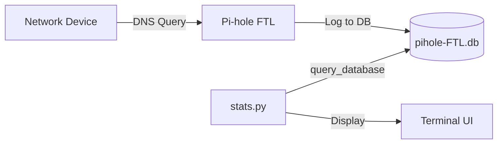
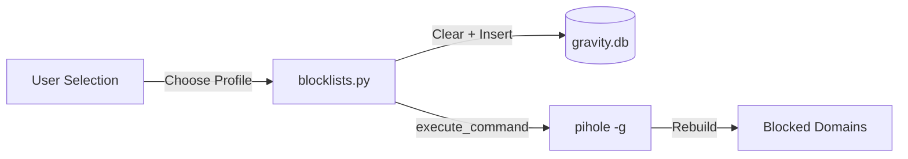
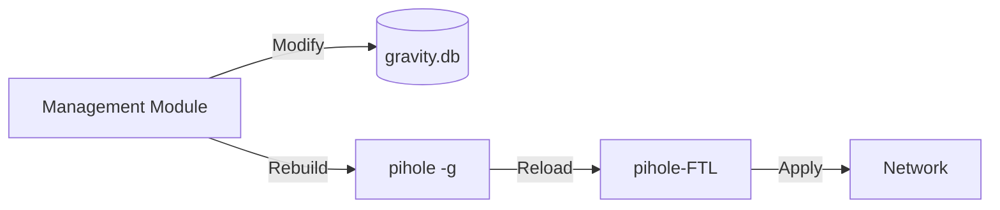

# Architecture Overview

**Version**: 2.0
**Last Updated**: 2025-11-19
**Purpose**: System architecture, component relationships, and design decisions for local execution model

---

## Table of Contents

1. [System Overview](#system-overview)
2. [Component Architecture](#component-architecture)
3. [Execution Model](#execution-model)
4. [Multi-Agent Development System](#multi-agent-development-system)
5. [Knowledge Base Design](#knowledge-base-design)
6. [Communication Patterns](#communication-patterns)
7. [Deployment Architecture](#deployment-architecture)
8. [Security Architecture](#security-architecture)
9. [Data Flow](#data-flow)
10. [Design Decisions](#design-decisions)

---

## System Overview

The Pi-hole Network Manager is a **local Python application** that runs directly on a Raspberry Pi to manage Pi-hole instances. The system uses subprocess-based local execution with passwordless sudo for Pi-hole operations.

```
┌────────────────────────────────────────────────────┐
│         Raspberry Pi (pihole.local)                │
│  ┌──────────────────────────────────────────────┐ │
│  │   Pi-hole Network Manager (Python App)       │ │
│  │   Location: /opt/pihole-network-manager       │ │
│  │                                                │ │
│  │   ┌────────────┐  ┌────────────────────────┐ │ │
│  │   │  main.py   │  │  Management Modules     │ │ │
│  │   │            │  │  - blocklists.py        │ │ │
│  │   │  - Setup   │  │  - devices.py           │ │ │
│  │   │  - Menu    │  │  - stats.py             │ │ │
│  │   │  - Config  │  │  - maintenance.py       │ │ │
│  │   └─────┬──────┘  │  - health.py            │ │ │
│  │         │         └────────────────────────┘ │ │
│  │         ▼                                     │ │
│  │   ┌────────────────────────────────────────┐ │ │
│  │   │   core/local_executor.py               │ │ │
│  │   │   - execute_command() (subprocess)     │ │ │
│  │   │   - query_database() (SQLite)          │ │ │
│  │   │   - read/write_file()                  │ │ │
│  │   └────────────┬───────────────────────────┘ │ │
│  │                │                              │ │
│  │                ▼                              │ │
│  │   ┌──────────────┐  ┌─────────────────────┐ │ │
│  │   │   Pi-hole    │  │  System Services     │ │ │
│  │   │              │  │  - pihole-FTL (DNS)  │ │ │
│  │   │ - FTL        │  │  - lighttpd (Web)    │ │ │
│  │   │ - gravity.db │  │  - systemd           │ │ │
│  │   └──────────────┘  └─────────────────────┘ │ │
│  └──────────────────────────────────────────────┘ │
└────────────────────────────────────────────────────┘
          │
          ▼ DNS Queries
┌────────────────────────────────────────────────────┐
│            Network Devices                         │
│  Computers, Phones, IoT Devices                    │
└────────────────────────────────────────────────────┘
```

**Key Characteristics:**
- **Single-component architecture**: Application runs on the same Raspberry Pi as Pi-hole
- **Local execution**: All Pi-hole commands execute via subprocess with passwordless sudo
- **No remote SSH**: Pi-hole operations execute locally
- **Direct database access**: Fast SQLite queries without subprocess overhead

---

## Component Architecture

### Application Structure

```
pihole-network-manager/
│
├── main.py                    # Entry point, menu system, venv management
│
├── core/                      # Core infrastructure
│   ├── config.py              # YAML configuration management
│   ├── local_executor.py      # Subprocess execution, SQLite queries, file I/O
│   ├── ui.py                  # Rich TUI components (menu, table, status)
│   ├── state.py               # Setup completion tracking
│   └── logger.py              # Session logging to /tmp/
│
├── management/                # Management modules (all use local_executor)
│   ├── blocklists.py          # Blocklist profile switching
│   ├── devices.py             # Device management, custom DNS
│   ├── lists.py               # Whitelist/blacklist management
│   ├── content_filter.py      # Time-based website blocking
│   ├── stats.py               # Query analytics and monitoring
│   ├── maintenance.py         # System updates, service control
│   └── health.py              # Health checks and diagnostics
│
├── pi-setup/                  # One-time setup on Pi
│   ├── initial-setup.sh       # Bash script for system setup
│   ├── templates/
│   │   └── sudoers-pihole-manager  # Passwordless sudo configuration
│   └── profiles/              # Blocklist profile YAML files
│       ├── light.yaml         # ~100K domains
│       ├── moderate.yaml      # ~300K domains
│       └── aggressive.yaml    # ~1M+ domains
│
└── .claude/                   # Multi-agent development system
    ├── agents/                # Agent configurations (for development)
    │   ├── pihole-scrum-leader.md
    │   └── project-knowledge-manager.md
    └── knowledge/             # Knowledge base (.kd files for AI agents)
        ├── code-architecture.kd
        ├── deployment-flows.kd
        ├── environment-config.kd
        ├── troubleshooting.kd
        └── agent-workflows.kd
```

### Core Modules

#### local_executor.py
**Purpose**: Subprocess-based execution layer for all Pi-hole operations

**Key Functions:**
```python
execute_command(command, sudo=False, timeout=30)
# Returns: (success: bool, stdout: str, stderr: str)

query_database(db_path, query)
# Returns: List[Tuple] (direct SQLite connection)

query_database_dict(db_path, query)
# Returns: List[Dict] (easier to use)

read_file(file_path)
# Returns: str (file contents)

write_file(file_path, content)
# Returns: bool (success)

file_exists(file_path)
# Returns: bool
```

**Design Decision**: Direct subprocess execution is faster and simpler than SSH for local operations. Database queries use direct SQLite connections for performance.

#### config.py
**Purpose**: Configuration management with encryption support

**Configuration Location**: `/opt/pihole-manager/config.yaml`

**Structure:**
```yaml
web_url: "http://192.168.1.100/admin"  # Pi-hole web interface
```

**Design Decision**: Pi-hole operations use passwordless sudo configured via sudoers.d file.

#### state.py
**Purpose**: Simple setup completion tracking

**State Location**: `/opt/pihole-manager/state.json`

**Structure:**
```json
{
  "setup_complete": true
}
```

**Design Decision**: State tracking is minimal - just a flag indicating whether `initial-setup.sh` has been run.

---

## Execution Model

### Local Execution Pattern

All Pi-hole operations execute locally via subprocess with passwordless sudo:



### Passwordless Sudo Configuration

**File**: `/etc/sudoers.d/pihole-manager`

**Key Grants**:
- `pihole` command (all subcommands)
- `systemctl` (for Pi-hole services)
- `sqlite3` (for database access)
- System maintenance commands

**Security**: Only specific commands are granted passwordless sudo. Users must be in the `pihole-manager` group.

---

## Multi-Agent Development System

### Agent Roles

The `.claude/` directory contains configuration for AI agents used during development:

1. **Scrum Leader** - Sprint orchestration, GitHub Flow, releases
2. **Knowledge Manager** - Maintains `.kd` files, enforces BLOCKING protocol
3. **Python Developer** - Python implementation, local testing
4. **Pi Infrastructure** - Raspberry Pi configuration, systemd
5. **UAT Pro** - Testing, verification, deployment

### BLOCKING Protocol

**Purpose**: Ensure knowledge base consistency across agent coordination

**Process**:
1. Agent requests knowledge update (sends KDL entry to Knowledge Manager)
2. Knowledge Manager validates syntax
3. Knowledge Manager updates `.kd` file and commits
4. Knowledge Manager confirms with line number
5. Agent unblocks and proceeds

**Why**: Prevents conflicting updates to knowledge base files during multi-agent development.

### Knowledge Base Design

**Format**: KDL (ultra-compact, token-optimized)

**Paired Documentation**:
- `.kd` files (AI-optimized, ~2.5x token compression vs markdown)
- `.md` files (human-readable with Mermaid diagrams)
- **1:1 pairing**: Every `.kd` file has a corresponding `.md` file

**Example**:
```kdl
# .claude/knowledge/code-architecture.kd
python::module::core-local-executor:core/local_executor.py|features:subprocess,file-ops,db-query|sudo:passwordless|location:pi

# docs/code-reference.md (paired human-readable doc)
## Local Executor
The `local_executor.py` module provides subprocess-based execution...
```

---

## Communication Patterns

### Internal (Within Pi)

```
Management Module
    ↓ function call
local_executor.py
    ↓ subprocess.run()
Pi-hole CLI / SQLite
```

**No network communication required** for Pi-hole operations.

**No external network communication required** for Pi-hole operations.

---

## Deployment Architecture

### Environment Tiers



**Development Environment**:
- Location: Developer's local computer
- Python 3.11+, virtual environment
- Unit testing, code development
- No Pi required

**Test Pi Environment**:
- Location: test-pi.local (Raspberry Pi)
- Autonomous deployment after local tests pass
- Integration testing, UAT
- Isolated network (no production impact)

**Production Pi Environment**:
- Location: pihole.local (Raspberry Pi)
- User approval REQUIRED for deployment
- Network-critical DNS service
- Serving all network devices

### Installation Process



**Key Files Created**:
- `/etc/sudoers.d/pihole-manager` - Passwordless sudo rules
- `/opt/pihole-manager/state.json` - Setup completion flag
- `/opt/pihole-manager/config.yaml` - Configuration (created on first run)
- `~/.pihole-manager-venv/` - Python virtual environment

---

## Security Architecture

### Privilege Management

**Principle**: Least privilege with specific command grants

**Implementation**:
1. User added to `pihole-manager` group during setup
2. Sudoers file grants passwordless sudo for specific commands only
3. No blanket sudo access
4. Validation with `visudo` for safety

**Commands Granted**:
```bash
# Pi-hole operations
%pihole-manager ALL=(ALL) NOPASSWD: /usr/local/bin/pihole

# Service management
%pihole-manager ALL=(ALL) NOPASSWD: /bin/systemctl restart pihole-FTL
%pihole-manager ALL=(ALL) NOPASSWD: /bin/systemctl status pihole-FTL

# Database access
%pihole-manager ALL=(ALL) NOPASSWD: /usr/bin/sqlite3 /etc/pihole/*.db

# System maintenance
%pihole-manager ALL=(ALL) NOPASSWD: /usr/bin/apt-get update
# ... (specific commands only)
```

### Network Security

**Firewall**: UFW configured during setup
- Port 22 (SSH) - For remote management
- Port 53 (DNS) - Pi-hole DNS queries
- Port 80 (HTTP) - Pi-hole web interface
- Port 443 (HTTPS) - Secure web interface

**SSH Hardening**: Recommended (not enforced)
- Key-based authentication
- Disable password authentication
- Fail2ban for brute-force protection

---

## Data Flow

### Query Analytics



### Blocklist Management



### Configuration Changes



---

## Design Decisions

### Why Local Execution vs. SSH?

**Previous Architecture**: Client tool on local computer → SSH → Raspberry Pi

**Current Architecture**: Application runs directly on Raspberry Pi

**Rationale**:
1. **Simplicity**: No SSH key management, no remote connection setup
2. **Performance**: Direct subprocess execution is faster than SSH
3. **Reliability**: No network dependency for Pi-hole operations
4. **Security**: Fewer attack surfaces (no SSH for Pi-hole operations)
5. **User Experience**: Single setup script instead of multi-step wizard

**Trade-off**: Must SSH to Pi to run the application, but this is standard for Raspberry Pi administration.

### Why Subprocess vs. Python Libraries?

**Decision**: Use subprocess to call Pi-hole CLI instead of reimplementing in Python

**Rationale**:
1. **Reliability**: Pi-hole CLI is authoritative and well-tested
2. **Maintainability**: No need to track Pi-hole API changes
3. **Completeness**: Access to all Pi-hole features via CLI
4. **Compatibility**: Works with any Pi-hole version that has the CLI

**Example**:
```python
# Option 1: Subprocess (chosen)
execute_command("pihole -g", sudo=True)

# Option 2: Reimplementation (rejected)
# Would require understanding Pi-hole internals, database schema changes, etc.
```

### Why Passwordless Sudo vs. Credentials?

**Decision**: Use passwordless sudo for specific commands instead of storing Pi-hole credentials

**Rationale**:
1. **Security**: No credentials stored on disk
2. **Granularity**: Can restrict to specific commands only
3. **Standard Practice**: Common pattern for system administration tools
4. **User Experience**: No password prompts during operation

**Implementation**: Sudoers file validated with `visudo` during setup to prevent syntax errors.

### Why Single State File vs. Multi-Step Tracking?

**Previous Architecture**: Tracked 4-5 setup steps with resume capability

**Current Architecture**: Single `setup_complete` flag

**Rationale**:
1. **Simplicity**: Setup is a single script - either it completed or it didn't
2. **Reliability**: No partial states to manage
3. **Debugging**: If setup fails, re-run the script (idempotent design)

**Trade-off**: Cannot resume from a specific step, but the script is fast enough (~5 minutes) that this doesn't matter.

### Why Virtual Environment Auto-Creation?

**Decision**: main.py automatically creates and activates venv if not present

**Rationale**:
1. **User Experience**: No manual venv setup required
2. **Isolation**: Prevents dependency conflicts with system Python
3. **Consistency**: Ensures same environment every time

**Implementation**:
```python
if not os.path.exists(venv_path):
    subprocess.run([sys.executable, "-m", "venv", venv_path])
    activate_venv(venv_path)
    install_dependencies()
```

---

## Conclusion

The Pi-hole Network Manager uses a **local execution architecture** for simplicity, performance, and reliability. The system runs directly on the Raspberry Pi, executing Pi-hole commands via subprocess with passwordless sudo. This design eliminates SSH complexity and provides a streamlined management experience.

**Key Architectural Principles**:
1. **Local-first**: Operations execute on the same device
2. **CLI-based**: Leverage Pi-hole's authoritative CLI
3. **Least privilege**: Specific sudo grants only
4. **Simple state**: Minimal setup tracking
5. **Modular design**: Clean separation between core and management modules

For detailed implementation patterns, see:
- `docs/code-reference.md` - Code architecture and patterns
- `docs/development-guide.md` - Development standards and practices
- `.claude/knowledge/*.kd` - AI-optimized knowledge base
