# Code Architecture Reference

**Version**: 2.0
**Last Updated**: 2025-11-19
**Paired KDL**: `.claude/knowledge/code-architecture.kd`

---

## Overview

This document provides visual representations of the Pi-hole Network Manager codebase architecture, module relationships, local execution patterns, and Pi-hole resource interactions.

**Execution Model**: Local execution on Raspberry Pi (no remote SSH for Pi-hole operations).

---

## System Architecture

```mermaid
graph TB
    subgraph Raspberry Pi
        Main[main.py<br/>Entry Point]
        Core[Core Modules<br/>config, local_executor, ui, state]
        Mgmt[Management Modules<br/>blocklists, devices, stats, etc.]
        LocalExec[local_executor.py<br/>Subprocess Execution]
        PiHole[Pi-hole<br/>DNS + Ad Blocking]
        PiHoleDBs[(Pi-hole Databases<br/>gravity.db, pihole-FTL.db)]
        Router[TP-Link Router<br/>AXE5400]
    end

    Main --> Core
    Main --> Mgmt

    Mgmt -->|Uses| LocalExec
    LocalExec -->|subprocess| PiHole
    LocalExec -->|sqlite3| PiHoleDBs
    Mgmt -->|SSH (optional)| Router

    PiHole --> PiHoleDBs

    style Core fill:#e1f5ff
    style PiHole fill:#ffe1e1
    style LocalExec fill:#e1ffe1
```

**Key Communication**:
- All Pi-hole operations use **local subprocess execution** (no SSH)
- Application runs directly on Raspberry Pi where Pi-hole is installed
- Router control (optional) uses SSH from Pi to router

---

## Module Dependency Graph

```mermaid
graph TD
    subgraph Core Layer
        Config[core/config.py<br/>YAML + Encryption]
        LocalExec[core/local_executor.py<br/>Subprocess Wrapper]
        UI[core/ui.py<br/>Rich Components]
        State[core/state.py<br/>Setup Complete Flag]
    end

    subgraph Management Layer
        MgmtBlock[management/blocklists.py]
        MgmtDev[management/devices.py]
        MgmtList[management/lists.py]
        MgmtCF[management/content_filter.py]
        MgmtStats[management/stats.py]
        MgmtRouter[management/router_control.py]
        MgmtMaint[management/maintenance.py]
        MgmtHealth[management/health.py]
    end

    Main[main.py] --> Config
    Main --> LocalExec
    Main --> UI

    MgmtBlock --> LocalExec
    MgmtBlock --> UI
    MgmtDev --> LocalExec
    MgmtDev --> UI
    MgmtList --> LocalExec
    MgmtCF --> LocalExec
    MgmtStats --> LocalExec
    MgmtRouter --> LocalExec
    MgmtMaint --> LocalExec
    MgmtHealth --> LocalExec

    style Config fill:#e1f5ff
    style LocalExec fill:#ffe1e1
    style UI fill:#e1ffe1
```

**Dependency Rules**:
- Core modules have NO dependencies on Management
- Management modules depend ONLY on Core (primarily local_executor + UI)
- No circular dependencies allowed

---

## Initial Setup Flow

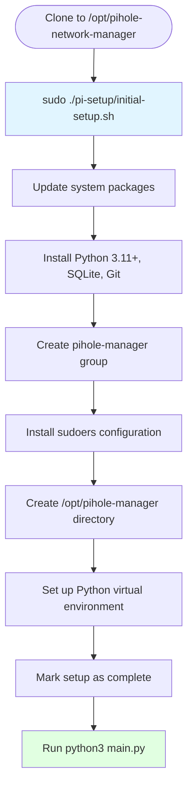

**Setup Script**: `pi-setup/initial-setup.sh`
- Runs once on Raspberry Pi
- Configures passwordless sudo for Pi-hole commands
- Creates configuration directories
- Sets up Python virtual environment
- Installs dependencies

---

## Local Execution Pattern

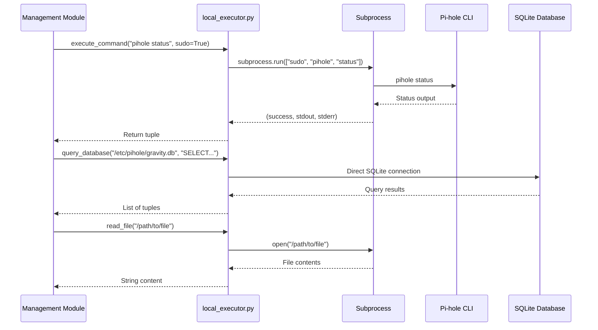

**local_executor API**:
```python
from core.local_executor import execute_command, query_database, read_file, write_file

# Execute commands
success, stdout, stderr = execute_command("pihole status", sudo=True)

# Database queries (faster than subprocess)
results = query_database("/etc/pihole/gravity.db", "SELECT * FROM domainlist")
results_dict = query_database_dict("/etc/pihole/gravity.db", "SELECT * FROM domainlist")

# File operations
content = read_file("/path/to/file")
write_file("/path/to/file", "content")
```

---

## Session Logging System

### Overview

The **SessionLogger** (`core/logger.py`) provides comprehensive lifecycle logging for the entire main.py execution. It captures menu selections, command execution, status messages, and exceptions.

**Pattern**: Singleton
**Log Format**: `pihole-manager-YYYYMMDD.log`
**Location**: `/tmp/`

### Log Entry Types

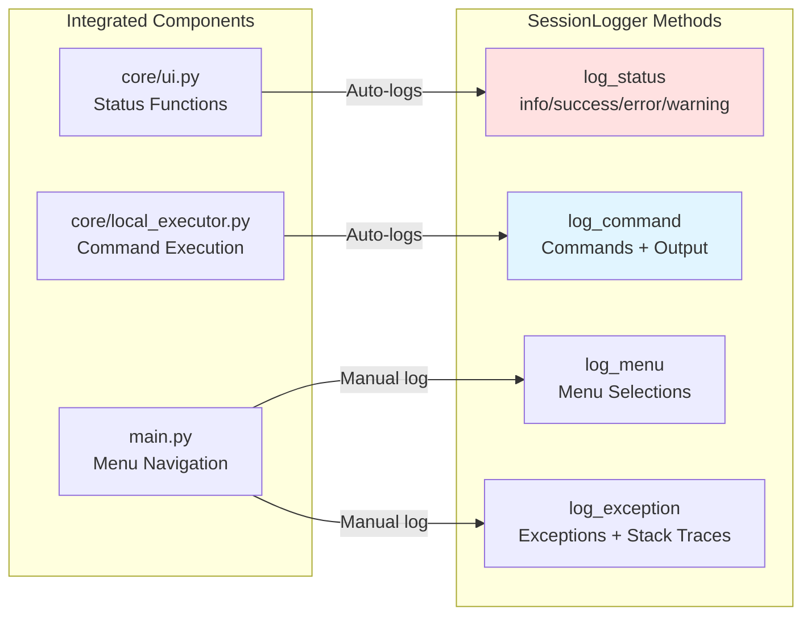

### Usage Pattern

```python
# Initialize at main.py start
from core.logger import SessionLogger

logger = SessionLogger.get_instance()
logger.start()

# Logger automatically captures:
# - All show_status(), show_success(), show_error() calls from core/ui.py
# - All execute_command() calls from core/local_executor.py

# Manual logging for menu selections
logger.log_menu("Main Menu", "1")

# Manual logging for exceptions
try:
    # ... code ...
except Exception as e:
    logger.log_exception(e, context="Operation failed")

# Stop at main.py exit
logger.stop()
```

### Log File Structure

```
[2025-11-19 10:15:23.456] [MENU] Main Menu -> Choice: 1
[2025-11-19 10:15:24.123] [INFO] Checking Pi-hole status...
[2025-11-19 10:15:24.789] [CMD] SUCCESS: pihole status
[2025-11-19 10:15:24.790] [CMD:STDOUT]   Pi-hole is running
[2025-11-19 10:15:26.678] [EXCEPTION] Operation failed
[2025-11-19 10:15:26.679] [EXCEPTION] FileNotFoundError: config.yaml not found
```

---

## State Management

### State Tracking System

**File**: `core/state.py`
**Storage**: `/opt/pihole-manager/state.json`
**Purpose**: Track setup completion

### Setup State

```json
{
  "setup_complete": true
}
```

**Simplified**: Only tracks whether initial setup has been run.

```python
from core.state import State

state = State()

# Check setup status
if state.is_setup_complete():
    # Run application
else:
    # Show error, direct to initial-setup.sh
```

---

## Pi-hole Database Schema

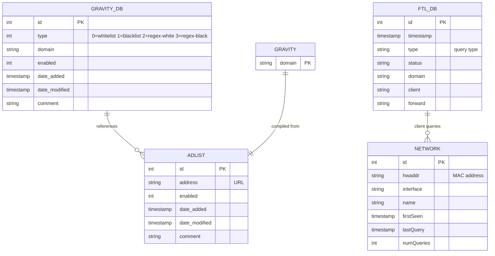

**Database Locations**:
- `/etc/pihole/gravity.db` - Domain lists (whitelist, blacklist, blocklists)
- `/etc/pihole/pihole-FTL.db` - Query logs and network devices

**SQL Operations**:
```python
from core.local_executor import query_database, execute_command

# Query domainlist (fast - direct SQLite)
results = query_database(
    "/etc/pihole/gravity.db",
    "SELECT * FROM domainlist WHERE type = 0;"
)

# Insert with SQL escaping (CRITICAL!)
domain_escaped = domain.replace("'", "''")
query = f"INSERT INTO domainlist (type, domain, enabled) VALUES (1, '{domain_escaped}', 1);"
execute_command(f"sqlite3 /etc/pihole/gravity.db \"{query}\"", sudo=True)

# Always rebuild gravity after changes
execute_command("pihole -g", sudo=True)
```

---

## Blocklist Profile System

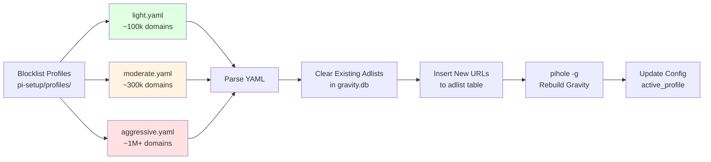

**Profile YAML Structure**:
```yaml
name: Moderate
description: Balanced blocking
estimated_domains: 300000
blocklists:
  - url: "https://..."
    comment: "Description"
```

**Switching Profiles**:
1. Clear existing adlists in `gravity.db`
2. Insert new blocklist URLs from profile YAML
3. Run `pihole -g` to rebuild gravity
4. Update `active_profile` in config

---

## Content Filter Rule Engine

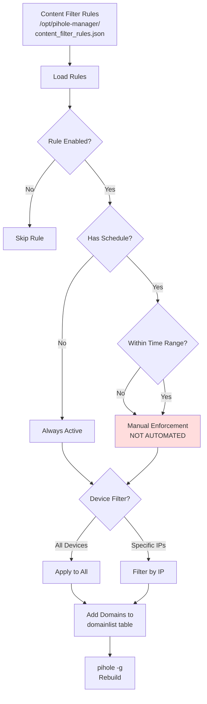

**Rule Structure**:
```json
{
  "id": 1,
  "name": "Block Social Media at Work",
  "category": "social_media",
  "enabled": true,
  "domains": ["facebook.com", "*.instagram.com"],
  "devices": ["192.168.1.10"],  // Empty = all devices
  "schedule": {
    "enabled": true,
    "start_time": "09:00",
    "end_time": "17:00",
    "days": ["Monday", "Tuesday", "Wednesday", "Thursday", "Friday"]
  }
}
```

**CRITICAL LIMITATION**: Time-based enforcement is **NOT automated**. Schedules exist but manual toggle required.

---

## Router Integration Pattern

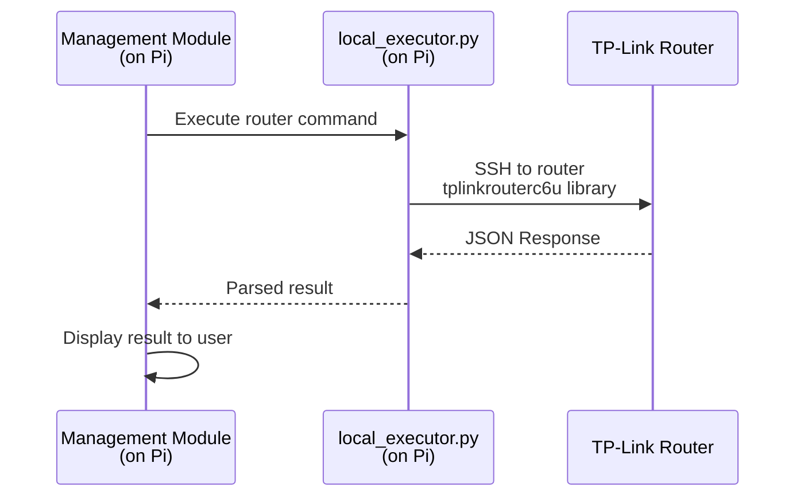

**Router Authentication**:
- Password encrypted with Fernet
- Stored in `/opt/pihole-manager/config.yaml`
- Optional feature (TP-Link AXE5400 only)

---

## Configuration Files

```mermaid
graph TB
    subgraph Configuration
        PiConfig[/opt/pihole-manager/<br/>config.yaml]
        StateFile[/opt/pihole-manager/<br/>state.json]
        Sudoers[/etc/sudoers.d/<br/>pihole-manager]
    end

    Main[main.py] -->|Read| PiConfig
    Main -->|Read| StateFile
    LocalExec[local_executor.py] -->|Uses| Sudoers

    style PiConfig fill:#fff4e1
    style StateFile fill:#e1f5ff
    style Sudoers fill:#ffe1e1
```

**Configuration Tracking**:
- Single config file on Pi
- Simple state tracking (setup complete flag only)
- Passwordless sudo for specific Pi-hole commands

---

## Service Dependencies

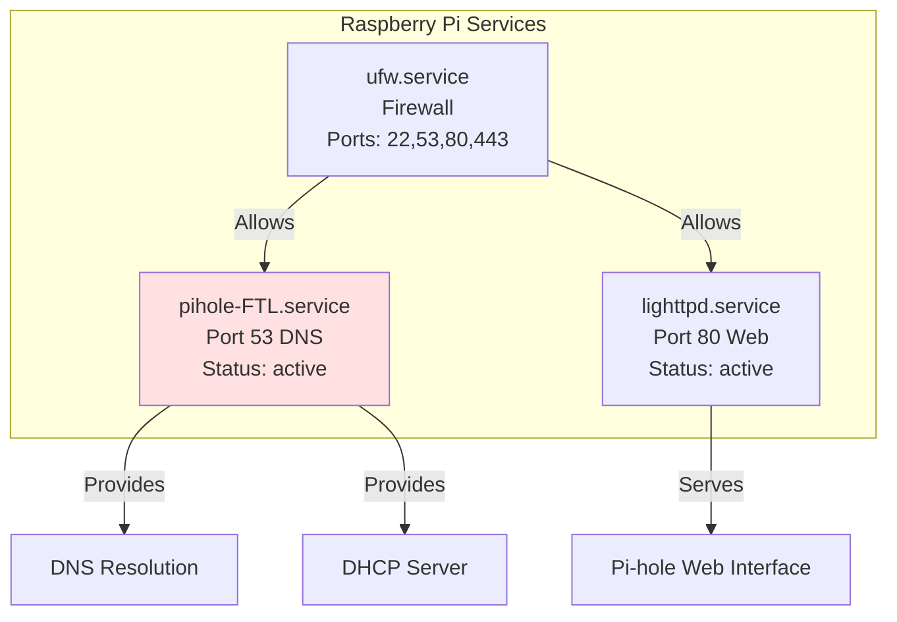

**Service Management**:
```python
from core.local_executor import execute_command

# Check service status
execute_command("systemctl status pihole-FTL", sudo=True)
execute_command("systemctl restart pihole-FTL", sudo=True)
execute_command("systemctl enable pihole-FTL", sudo=True)
```

---

## Management Module Pattern

All management modules follow this structure:

```mermaid
flowchart TD
    Start([Module Entry: run()]) --> Menu[Show Menu<br/>show_menu()]

    Menu --> Choice{User Choice}

    Choice -->|1| Option1[Handle Option 1]
    Choice -->|2| Option2[Handle Option 2]
    Choice -->|3| Option3[Handle Option 3]
    Choice -->|9| Back[Return/Exit]

    Option1 --> Exec1[execute_command()]
    Option2 --> Exec2[execute_command()]
    Option3 --> Exec3[execute_command()]

    Exec1 --> UI1[Display Result<br/>show_table/show_status]
    Exec2 --> UI2[Display Result]
    Exec3 --> UI3[Display Result]

    UI1 --> Menu
    UI2 --> Menu
    UI3 --> Menu
    Back --> End([Return to Main])
```

**Module Template**:
```python
from core.local_executor import execute_command
from core.ui import show_menu
from core.config import Config

def run(config: Config):
    """Main module entry point"""
    while True:
        options = ["Option 1", "Option 2", "Option 3"]
        choice = show_menu("Module Name", options, allow_back=True)

        if choice == "9":  # Always Back/Exit
            break
        elif choice == "1":
            handle_option_1(config)
        elif choice == "2":
            handle_option_2(config)
        elif choice == "3":
            handle_option_3(config)
```

---

## UI Component Hierarchy

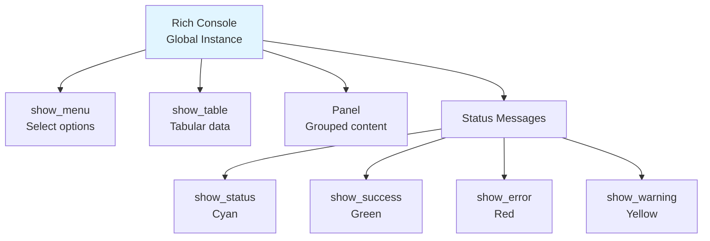

**Usage**:
```python
from core.ui import show_menu, show_table, show_status, console

# Menus
choice = show_menu("Title", ["Option 1", "Option 2"], allow_back=True)

# Tables
show_table("Title", ["Header1", "Header2"], [["row1col1", "row1col2"]])

# Status messages (NEVER use print())
show_status("Processing...", "info")    # Cyan
show_success("Done!")                   # Green
show_error("Failed!")                   # Red
show_warning("Caution")                 # Yellow
```

---

## Critical Code Patterns

### 1. SQL Escaping (MANDATORY)

```python
# WRONG - SQL injection risk
domain = "test'.com"
query = f"INSERT INTO domainlist VALUES (1, '{domain}', 1);"

# CORRECT
domain_escaped = domain.replace("'", "''")
query = f"INSERT INTO domainlist VALUES (1, '{domain_escaped}', 1);"
```

### 2. Sudo Required for Pi-hole

```python
from core.local_executor import execute_command

# WRONG - will fail
execute_command("pihole status")

# CORRECT
execute_command("pihole status", sudo=True)
```

### 3. Gravity Rebuild After Changes

```python
# Add domain to blacklist
execute_command(f"pihole -b {domain}", sudo=True)

# REQUIRED - rebuild gravity
execute_command("pihole -g", sudo=True)
```

### 4. Database Queries - Use Direct Access

```python
from core.local_executor import execute_command, query_database

# SLOWER - via subprocess
success, output, _ = execute_command(
    "sqlite3 /etc/pihole/gravity.db 'SELECT * FROM domainlist;'",
    sudo=True
)

# FASTER - direct SQLite connection
results = query_database("/etc/pihole/gravity.db", "SELECT * FROM domainlist")
```

---

## File Locations Reference

| Resource | Location | Sudo Required |
|----------|----------|---------------|
| Gravity Database | `/etc/pihole/gravity.db` | Write: Yes |
| FTL Database | `/etc/pihole/pihole-FTL.db` | Read: Yes |
| Pi-hole Config | `/etc/pihole/setupVars.conf` | Yes |
| Blocklist Profiles | `pi-setup/profiles/*.yaml` | No (read-only) |
| State File | `/opt/pihole-manager/state.json` | Yes |
| Pi Config | `/opt/pihole-manager/config.yaml` | Yes |
| Sudoers Config | `/etc/sudoers.d/pihole-manager` | Yes (read-only) |
| Session Logs | `/tmp/pihole-manager-*.log` | No |
| Virtual Env | `~/.pihole-manager-venv/` | No |

---

## Import Graph

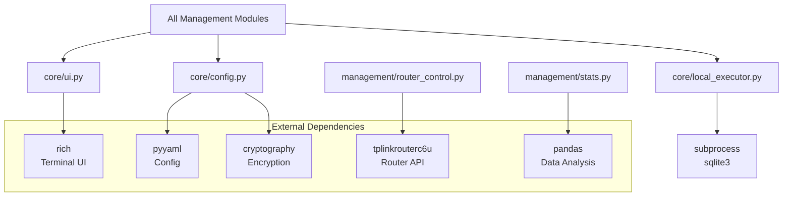

---

## References

- **KDL File**: `.claude/knowledge/code-architecture.kd`
- **Development Guide**: `docs/development-guide.md`
- **Architecture Overview**: `docs/architecture.md`

---

## Quick Reference

**Common Operations**:
```python
from core.local_executor import execute_command, query_database, read_file, write_file

# Execute Pi-hole command
success, stdout, stderr = execute_command("pihole status", sudo=True)

# Query database (fast - direct SQLite)
results = query_database("/etc/pihole/gravity.db", "SELECT * FROM domainlist")

# Query database with dict results (easier to use)
results = query_database_dict("/etc/pihole/gravity.db", "SELECT * FROM domainlist")
# Returns: [{"id": 1, "domain": "example.com", ...}, ...]

# Read file
content = read_file("/path/to/file")

# Write file
write_file("/path/to/file", "content")

# Display menu
choice = show_menu("Title", ["Option 1", "Option 2"], allow_back=True)

# Show table
show_table("Results", ["Column 1", "Column 2"], [["data1", "data2"]])
```
