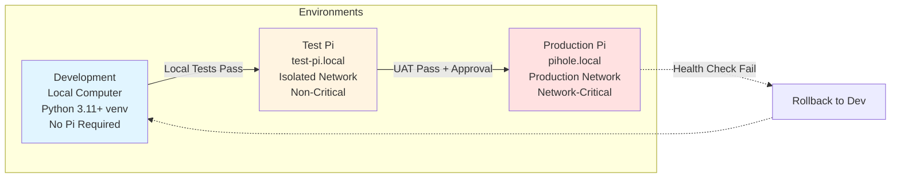
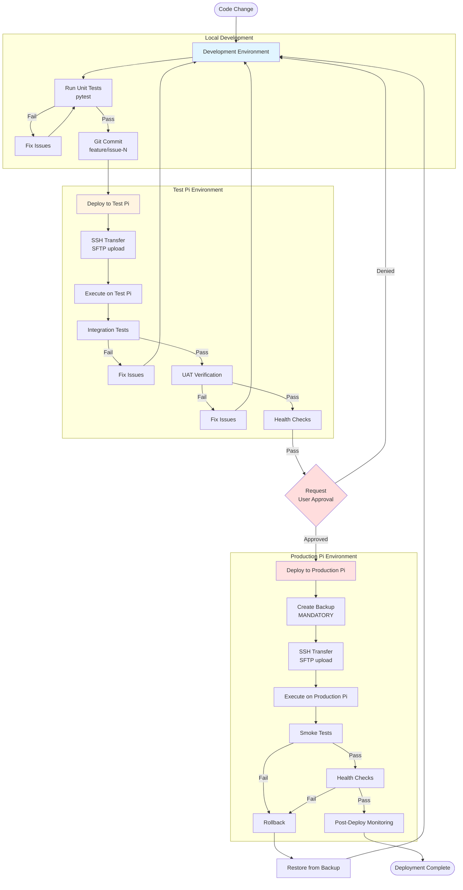
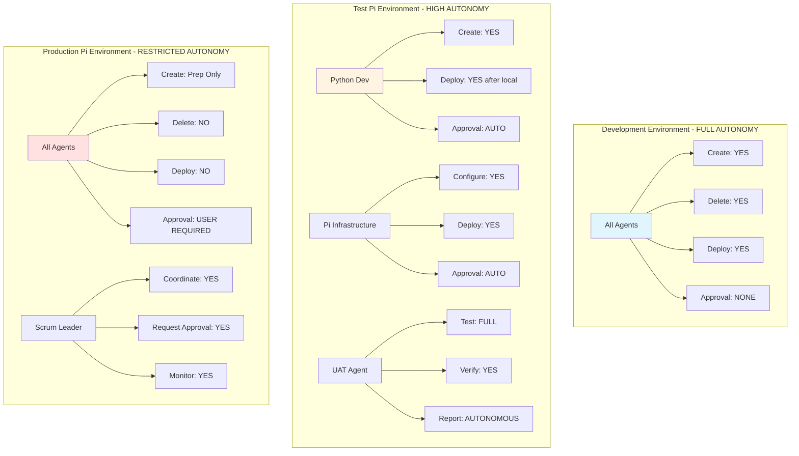
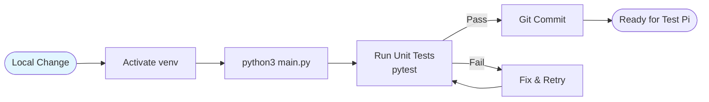
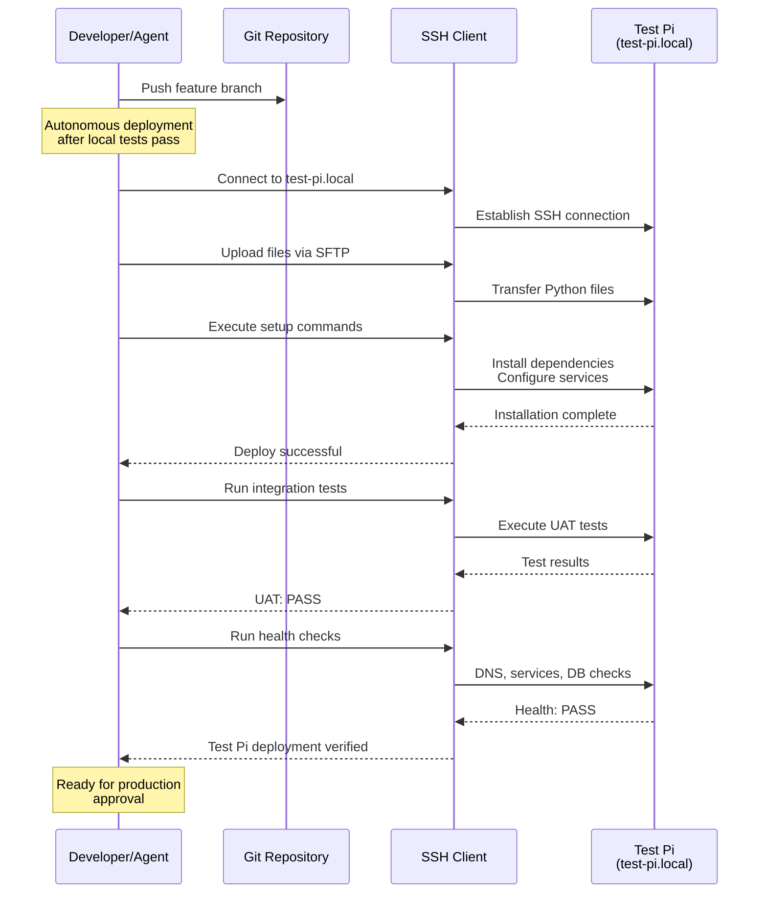
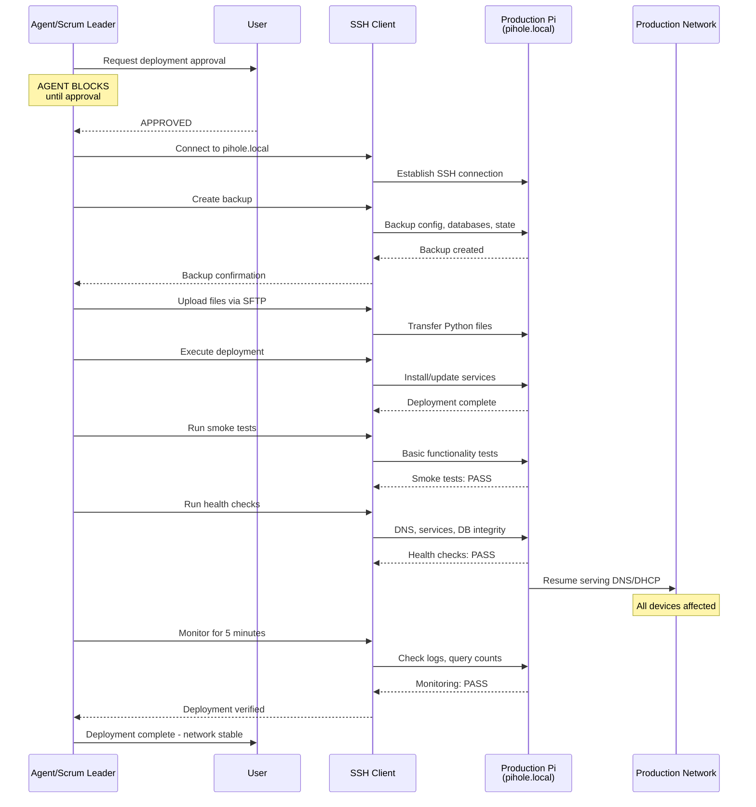
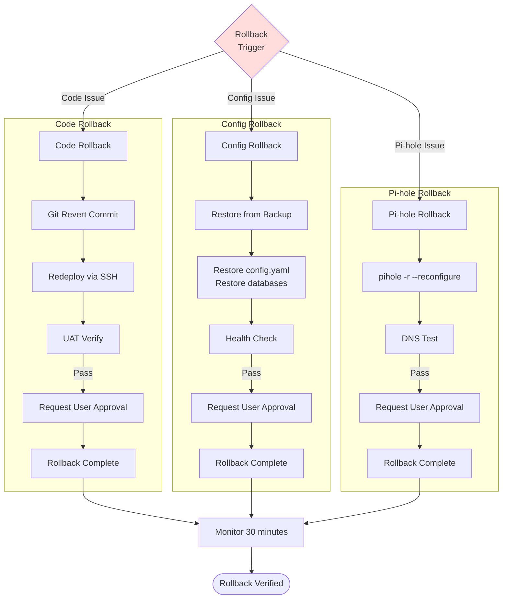
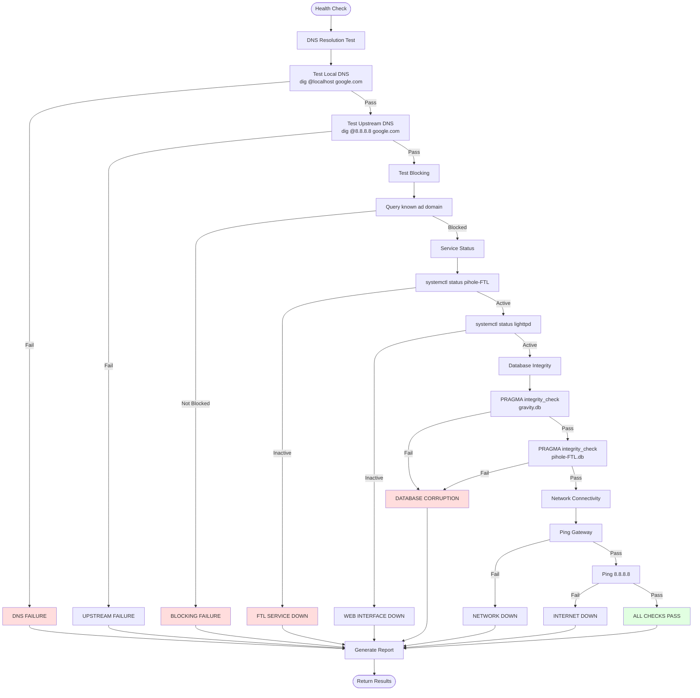
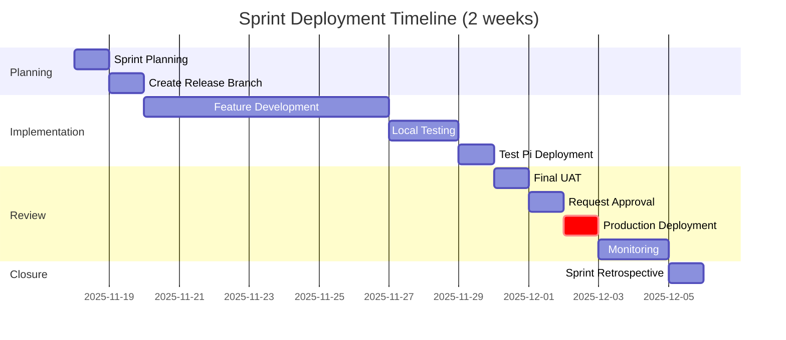
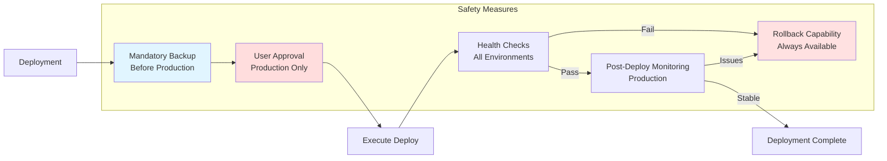

# Deployment Guide and Environment Configuration

**Version**: 1.0
**Last Updated**: 2025-11-18
**Paired KDL**: `.claude/knowledge/deployment-flows.kd`, `.claude/knowledge/environment-config.kd`

---

## Overview

This document provides comprehensive deployment procedures, environment tier configurations, and agent autonomy rules for the Pi-hole Network Manager across three deployment environments.

---

## Environment Tiers



### Environment Details

| Aspect | Development | Test Pi | Production Pi |
|--------|-------------|---------|---------------|
| **Location** | Local computer | test-pi.local | pihole.local |
| **Python** | 3.11+ | 3.11+ | 3.11+ |
| **Pi Required** | No | Yes | Yes |
| **SSH** | Mock for unit tests | Real SSH | Real SSH |
| **Network Impact** | None | Isolated test network | **Entire production network** |
| **Approval** | None | Auto after local tests | **User approval required** |
| **Autonomy** | Full | High (autonomous deploy) | Restricted |
| **Git Branch** | feature/* branches | release/sprint-N | main |
| **Testing** | Unit tests | Integration + UAT | Smoke tests + health checks |
| **Rollback** | N/A | Yes | **Yes (mandatory backup first)** |

---

## Deployment Flow: End-to-End



---

## Agent Autonomy by Environment



### Autonomy Matrix

| Agent | Dev | Test Pi | Production Pi |
|-------|-----|---------|---------------|
| **Python Developer** | Full autonomy | Deploy after local tests pass | Prep only, no deploy |
| **Pi Infrastructure** | Full autonomy | Configure & deploy autonomously | Prep only, no deploy |
| **UAT Agent** | Full testing autonomy | Full testing autonomy | Smoke tests only, report |
| **Scrum Leader** | Full orchestration | Coordinate deployment | Request approval, monitor |
| **Knowledge Manager** | Update autonomously | Update autonomously | Update autonomously |

---

## Deployment Methods

### 1. Local Development Deployment



**Commands**:
```bash
# Setup virtual environment
python3 -m venv ~/.pihole-manager-venv
source ~/.pihole-manager-venv/bin/activate

# Install dependencies
pip install -r requirements.txt

# Run locally
python3 main.py

# Run tests
pytest tests/

# Commit
git add .
git commit -m "feature: description"
```

**Characteristics**:
- No approval required
- Full autonomy for all agents
- Mock SSH connections for unit tests
- Git: feature/* branches

---

### 2. Test Pi Deployment



**Deployment Script**:
```bash
# Connect and transfer
ssh pi@test-pi.local "mkdir -p ~/pihole-network-manager"
scp -r * pi@test-pi.local:~/pihole-network-manager/

# Execute setup
ssh pi@test-pi.local "cd ~/pihole-network-manager && sudo python3 setup.py"

# Run integration tests
ssh pi@test-pi.local "cd ~/pihole-network-manager && pytest tests/integration/"

# Health check
ssh pi@test-pi.local "cd ~/pihole-network-manager && python3 health_check.py"
```

**Characteristics**:
- Autonomous deployment after local tests pass
- No user approval required
- Isolated test network (no production impact)
- Git: release/sprint-N branches
- Full integration and UAT testing

---

### 3. Production Pi Deployment



**Deployment Script**:
```bash
# Request approval (via agent coordination)
# USER MUST APPROVE BEFORE PROCEEDING

# Create backup
ssh pi@pihole.local "sudo ~/pihole-network-manager/backup.sh"

# Transfer files
ssh pi@pihole.local "mkdir -p ~/pihole-network-manager-new"
scp -r * pi@pihole.local:~/pihole-network-manager-new/

# Deploy (with rollback capability)
ssh pi@pihole.local "
    sudo mv ~/pihole-network-manager ~/pihole-network-manager-backup &&
    sudo mv ~/pihole-network-manager-new ~/pihole-network-manager &&
    cd ~/pihole-network-manager &&
    sudo python3 setup.py
"

# Smoke test
ssh pi@pihole.local "dig @localhost google.com"

# Health check
ssh pi@pihole.local "cd ~/pihole-network-manager && python3 health_check.py"

# Monitor
ssh pi@pihole.local "journalctl -u pihole-FTL -f --since '5 minutes ago'"
```

**Characteristics**:
- **USER APPROVAL REQUIRED** (mandatory gate)
- Backup created BEFORE deployment
- Network-critical operation (affects all devices)
- Git: main branch only
- Smoke tests + health checks + monitoring
- Rollback capability ready

---

## Rollback Procedures



### Rollback Commands

**Code Rollback**:
```bash
# Revert commit
git revert <commit-hash>
git push origin main

# Redeploy
ssh pi@pihole.local "
    cd ~/pihole-network-manager &&
    git pull &&
    sudo systemctl restart pihole-manager
"

# Verify
ssh pi@pihole.local "cd ~/pihole-network-manager && python3 health_check.py"
```

**Config Rollback**:
```bash
# Restore from backup
ssh pi@pihole.local "
    sudo cp ~/pihole-network-manager-backup/config.yaml ~/pihole-network-manager/ &&
    sudo cp ~/pihole-network-manager-backup/gravity.db /etc/pihole/ &&
    sudo systemctl restart pihole-FTL
"

# Verify
ssh pi@pihole.local "pihole status"
```

**Pi-hole Repair**:
```bash
# Reconfigure Pi-hole
ssh pi@pihole.local "sudo pihole -r"

# Select: Reconfigure

# Verify DNS
dig @pihole.local google.com
```

---

## Health Check Procedures



**Health Check Script**:
```bash
#!/bin/bash

echo "=== Health Check ==="

# DNS Resolution
echo "Testing DNS resolution..."
dig @localhost google.com +short || echo "❌ DNS FAIL"

# Blocking Test
echo "Testing blocking..."
dig @localhost ads.example.com +short | grep "0.0.0.0" || echo "❌ BLOCKING FAIL"

# Service Status
echo "Checking services..."
systemctl is-active pihole-FTL || echo "❌ FTL DOWN"
systemctl is-active lighttpd || echo "❌ WEB DOWN"

# Database Integrity
echo "Checking databases..."
sqlite3 /etc/pihole/gravity.db "PRAGMA integrity_check;" || echo "❌ DB CORRUPT"

# Network
echo "Checking network..."
ping -c 1 8.8.8.8 || echo "❌ NETWORK DOWN"

echo "✅ Health check complete"
```

---

## Sprint-Based Deployment



**Sprint Deployment Stages**:

1. **Planning** (Day 1-2):
   - Create `release/sprint-N` branch
   - Update `.claude/knowledge/deployment-flows.kd`
   - Notify all agents

2. **Implementation** (Day 3-10):
   - Feature branches merge to release branch
   - Continuous local testing
   - UAT verification per feature

3. **Review** (Day 11-14):
   - Deploy to Test Pi
   - Final UAT pass
   - Request user approval
   - Deploy to Production Pi
   - Monitor for 48 hours

4. **Closure** (Day 15):
   - Sprint retrospective
   - Update knowledge base
   - Merge release branch to main

---

## Deployment Checklist

### Pre-Deployment

- [ ] Local tests pass
- [ ] Knowledge base updated (BLOCKING protocol)
- [ ] Git branch correct (feature → release → main)
- [ ] Test Pi deployment successful
- [ ] UAT verification complete
- [ ] User approval obtained (for production)
- [ ] Backup created (for production)

### Deployment

- [ ] SSH connection established
- [ ] Files transferred successfully
- [ ] Dependencies installed
- [ ] Services configured
- [ ] Smoke tests pass
- [ ] Health checks pass

### Post-Deployment

- [ ] Monitoring active (5-30 minutes)
- [ ] Logs reviewed
- [ ] Network stability confirmed
- [ ] Knowledge base updated
- [ ] Deployment documented

---

## Safety Mechanisms



---

## Environment-Specific Configuration

### Development

```yaml
environment: development
python_version: 3.11+
venv_path: ~/.pihole-manager-venv
ssh_mock: true
pi_required: false
approval: none
autonomy: full
```

### Test Pi

```yaml
environment: test-pi
host: test-pi.local
ssh_user: pi
ssh_key: ~/.ssh/pihole_ed25519
pihole_installed: true
network: isolated-test-network
approval: auto-after-local-pass
autonomy: high
```

### Production Pi

```yaml
environment: production
host: pihole.local
ssh_user: pi
ssh_key: ~/.ssh/pihole_ed25519
pihole_installed: true
network: production-network
network_critical: true
approval: user-mandatory
autonomy: restricted
backup_before_deploy: mandatory
monitoring: post-deploy-required
```

---

## References

- **KDL Files**: `.claude/knowledge/deployment-flows.kd`, `.claude/knowledge/environment-config.kd`
- **Agent Coordination**: `docs/agent-coordination.md`
- **Deployment Procedures (legacy)**: `docs/deployment-procedures.md`

---

## Quick Reference

**Deploy to Test Pi**:
```bash
ssh pi@test-pi.local "mkdir -p ~/pihole-network-manager"
scp -r * pi@test-pi.local:~/pihole-network-manager/
ssh pi@test-pi.local "cd ~/pihole-network-manager && sudo python3 setup.py"
```

**Deploy to Production** (after approval):
```bash
ssh pi@pihole.local "sudo ~/pihole-network-manager/backup.sh"
scp -r * pi@pihole.local:~/pihole-network-manager-new/
ssh pi@pihole.local "sudo mv ~/pihole-network-manager ~/pihole-network-manager-backup && sudo mv ~/pihole-network-manager-new ~/pihole-network-manager"
ssh pi@pihole.local "cd ~/pihole-network-manager && python3 health_check.py"
```

**Rollback**:
```bash
ssh pi@pihole.local "sudo mv ~/pihole-network-manager ~/pihole-network-manager-failed && sudo mv ~/pihole-network-manager-backup ~/pihole-network-manager"
ssh pi@pihole.local "sudo systemctl restart pihole-FTL"
```
