# Troubleshooting Guide

**Version**: 1.0
**Last Updated**: 2025-11-18
**Paired KDL**: `.claude/knowledge/troubleshooting.kd`

---

## Overview

This document provides visual troubleshooting decision trees and resolution procedures for common issues encountered in the Pi-hole Network Manager.

---

## Quick Diagnostic Tree

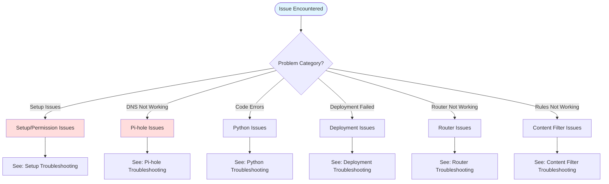

---

## Setup and Permission Issues

### Setup Troubleshooting Tree

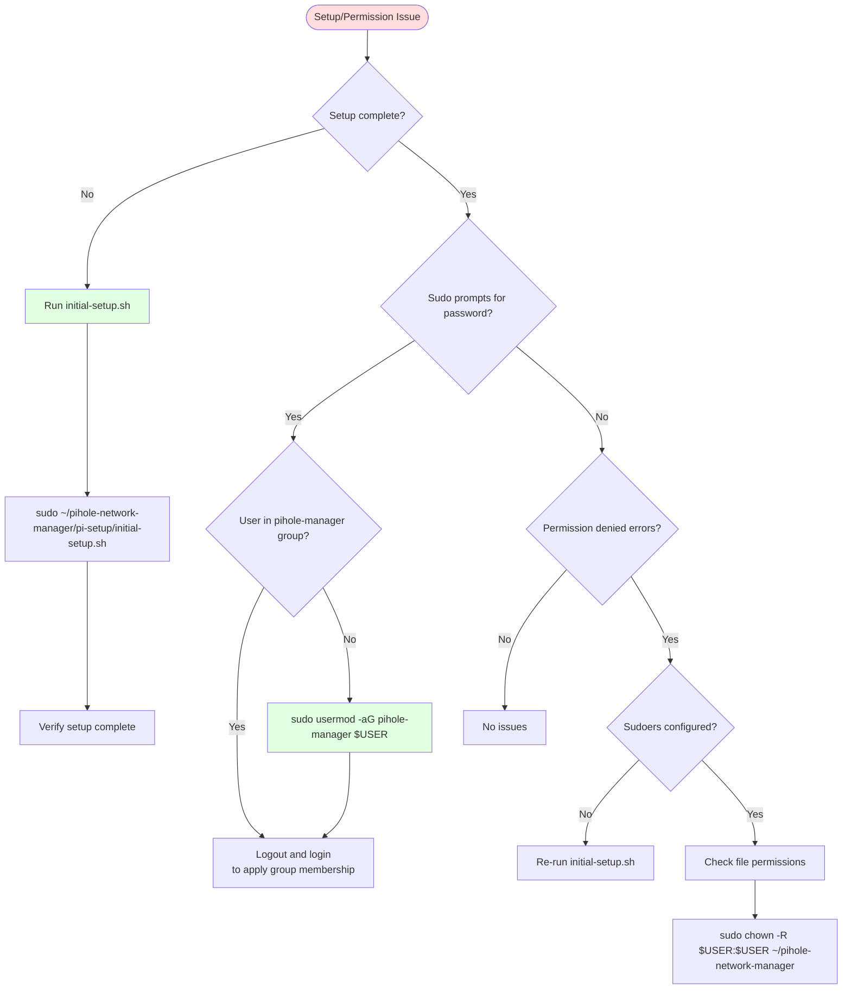

### Setup Issue Reference Table

| Issue | Cause | Fix | Severity | Common |
|-------|-------|-----|----------|--------|
| **Permission Denied** | Sudoers not configured | Re-run initial-setup.sh or check group membership | High | ✅ |
| **Sudo Password Prompt** | User not in pihole-manager group | Logout/login after setup | Medium | ✅ |
| **Command Not Found** | Pi-hole not installed | Install Pi-hole first | Critical | ⚠️ |
| **Database Locked** | pihole-FTL accessing database | Stop pihole-FTL or retry | Medium | ⚠️ |
| **Setup Not Complete** | initial-setup.sh not run | Run setup script | Critical | ✅ |

### Setup Resolution Procedures

#### Issue: Permission Denied

```bash
# Check if sudoers file exists
sudo ls -l /etc/sudoers.d/pihole-manager
# Should exist with permissions 440

# Check group membership
groups
# Should include "pihole-manager"

# If group missing, add user to group
sudo usermod -aG pihole-manager $USER

# Logout and login for group changes to take effect
exit
# SSH back in or restart session

# If still failing, re-run setup
sudo ~/pihole-network-manager/pi-setup/initial-setup.sh
```

#### Issue: Setup Not Complete

```bash
# Check setup status
cat ~/pihole-network-manager/state.json
# Should show: {"setup_complete": true}

# If not complete or file missing, run setup
sudo ~/pihole-network-manager/pi-setup/initial-setup.sh

# Follow prompts - setup will:
# 1. Create virtual environment
# 2. Install dependencies
# 3. Configure passwordless sudo
# 4. Set up configuration file
```

#### Issue: Sudo Password Prompt

```bash
# Test if passwordless sudo works
sudo -n pihole status
# Should execute without password prompt

# If prompts for password, check group membership
groups
# Must include "pihole-manager"

# If group is present, logout and login again
exit
# SSH back in

# Test again
sudo -n pihole status

# If still failing, check sudoers file
sudo cat /etc/sudoers.d/pihole-manager
# Should contain grants for pihole commands
```

---

## Pi-hole Issues

### DNS Failure Troubleshooting Tree

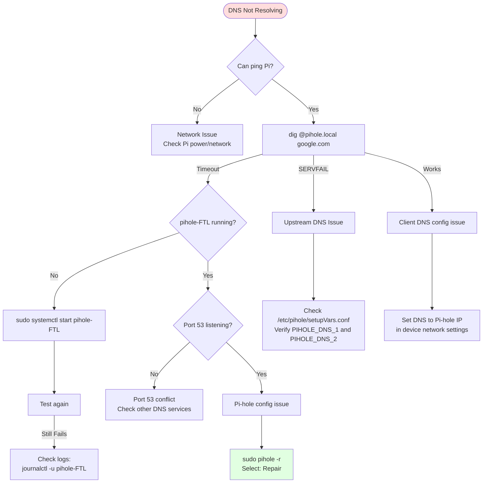

### Pi-hole Issue Reference Table

| Issue | Cause | Fix | Severity | Common |
|-------|-------|-----|----------|--------|
| **Gravity Timeout** | Large blocklist or slow Pi | Use smaller profile or wait | Low | ⚠️ |
| **DNS Queries Not Resolving** | pihole-FTL service down | `sudo systemctl restart pihole-FTL` | Critical | ⚠️ |
| **Legitimate Sites Blocked** | Aggressive blocklist | Switch to moderate profile or whitelist | Medium | ✅ |
| **Gravity Database Corrupt** | Power failure or disk error | `sudo pihole -r --reconfigure` | High | ⚠️ |
| **Update Fails** | Network or repo unavailable | Check internet, retry later | Medium | ⚠️ |
| **Web Interface 404** | lighttpd service down | `sudo systemctl restart lighttpd` | Medium | ⚠️ |

### Pi-hole Resolution Procedures

#### Issue: DNS Queries Not Resolving

```bash
# Check service status
sudo systemctl status pihole-FTL

# If inactive, start it
sudo systemctl start pihole-FTL

# If active but not working, restart
sudo systemctl restart pihole-FTL

# Test DNS
dig @localhost google.com

# Check logs if still failing
sudo journalctl -u pihole-FTL -n 50
```

#### Issue: Gravity Database Corruption

```bash
# Repair Pi-hole (interactive)
sudo pihole -r

# Select option: Repair

# Or reconfigure (non-interactive)
sudo pihole -r --reconfigure

# Verify
pihole status
dig @localhost google.com
```

#### Issue: Blocking Too Aggressive

```bash
# Via management tool
./pihole-manager.py
# → Blocklist Management
# → Switch Profile
# → Select: Moderate (or Light)

# OR manually whitelist specific domains
pihole -w facebook.com youtube.com
pihole -g  # Rebuild gravity
```

#### Issue: Web Interface Not Accessible

```bash
# Check lighttpd status
sudo systemctl status lighttpd

# Restart if needed
sudo systemctl restart lighttpd

# Check if port 80 is listening
sudo netstat -tulpn | grep :80

# Access web interface
# http://pihole.local/admin
```

---

## Python Issues

### Python Error Troubleshooting Tree

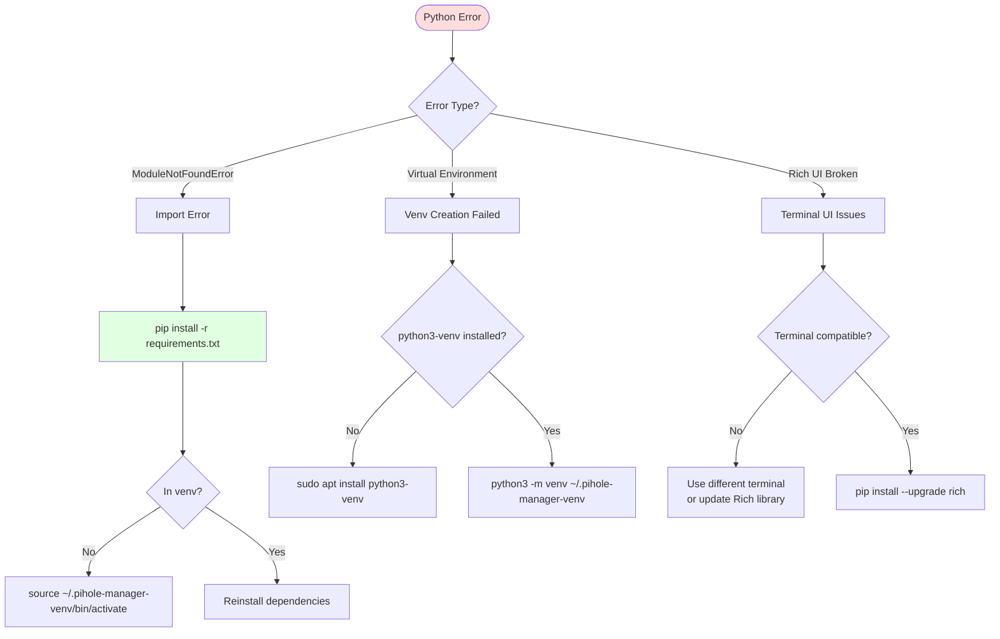

### Python Issue Reference Table

| Issue | Cause | Fix | Severity | Common |
|-------|-------|-----|----------|--------|
| **Venv Creation Failed** | python3-venv not installed | `sudo apt install python3-venv` | High | ✅ |
| **Import Error** | Missing dependency | `pip install -r requirements.txt` | High | ✅ |
| **Rich UI Broken** | Terminal not compatible | Use different terminal or `pip install --upgrade rich` | Low | ⚠️ |
| **Venv Not Activated** | Dependencies not found | `main.py` activates venv automatically | Low | ⚠️ |

### Python Resolution Procedures

#### Issue: Module Import Fails

```bash
# Activate virtual environment
source ~/.pihole-manager-venv/bin/activate

# Verify you're in venv
which python3
# Should show: ~/.pihole-manager-venv/bin/python3

# Install dependencies
pip install -r requirements.txt

# Verify installation
pip list | grep paramiko
pip list | grep rich
pip list | grep pyyaml

# Run application
python3 main.py
```

#### Issue: Virtual Environment Creation Failed

```bash
# Install python3-venv package
sudo apt update
sudo apt install python3-venv

# Create virtual environment
python3 -m venv ~/.pihole-manager-venv

# Activate
source ~/.pihole-manager-venv/bin/activate

# Install dependencies
pip install -r requirements.txt
```

---

## Deployment Issues

### Deployment Failure Troubleshooting Tree

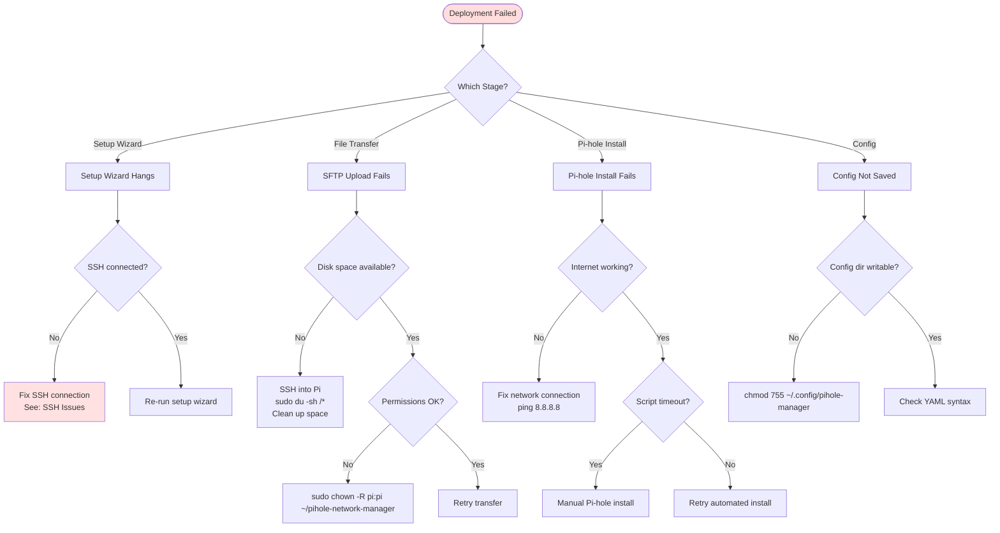

### Deployment Issue Reference Table

| Issue | Cause | Fix | Severity | Common |
|-------|-------|-----|----------|--------|
| **Setup Wizard Hangs** | SSH connection lost | Check network, re-run wizard | High | ⚠️ |
| **SFTP Upload Fails** | Permissions or disk space | Check Pi disk space and permissions | High | ⚠️ |
| **Files Already Transferred (False Positive)** | State marked before verification | Use Retry File Transfer (Option 5) | High | ✅ FIXED |
| **Pi-hole Install Fails** | Network or script timeout | Manual install or retry | Critical | ⚠️ |
| **Config Not Saved** | YAML write error | Check `~/.config/pihole-manager` permissions | Medium | ⚠️ |

### Deployment Resolution Procedures

#### Issue: Git Clone Fails

```bash
# On the Pi, check network connectivity
ping -c 3 github.com

# If network is down, check internet connection
cat /etc/resolv.conf

# Retry clone
cd /opt
sudo git clone https://github.com/yourusername/pihole-network-manager.git

# If still failing, check GitHub status
# https://www.githubstatus.com/
```

#### Issue: Permission Denied After Clone

```bash
# On the Pi, check ownership
ls -ld ~/pihole-network-manager

# Fix ownership
sudo chown -R $USER:$USER ~/pihole-network-manager

# Verify
ls -ld ~/pihole-network-manager
# Should show your user as owner
```

#### Issue: Initial Setup Fails

```bash
# On the Pi, check disk space
df -h

# If disk full, clean up
sudo apt clean && sudo apt autoremove

# Check Python version
python3 --version
# Should be 3.11 or higher

# Re-run setup
sudo ~/pihole-network-manager/pi-setup/initial-setup.sh

# Monitor logs if needed
tail -f /tmp/pihole-manager-*.log
```


---

## Session Logging for Debugging

**Location**: `/tmp/pihole-manager-*.log`

Every session is logged with:
- Menu selections
- Command executions and output
- State changes
- Exceptions with stack traces

**How to view logs**:

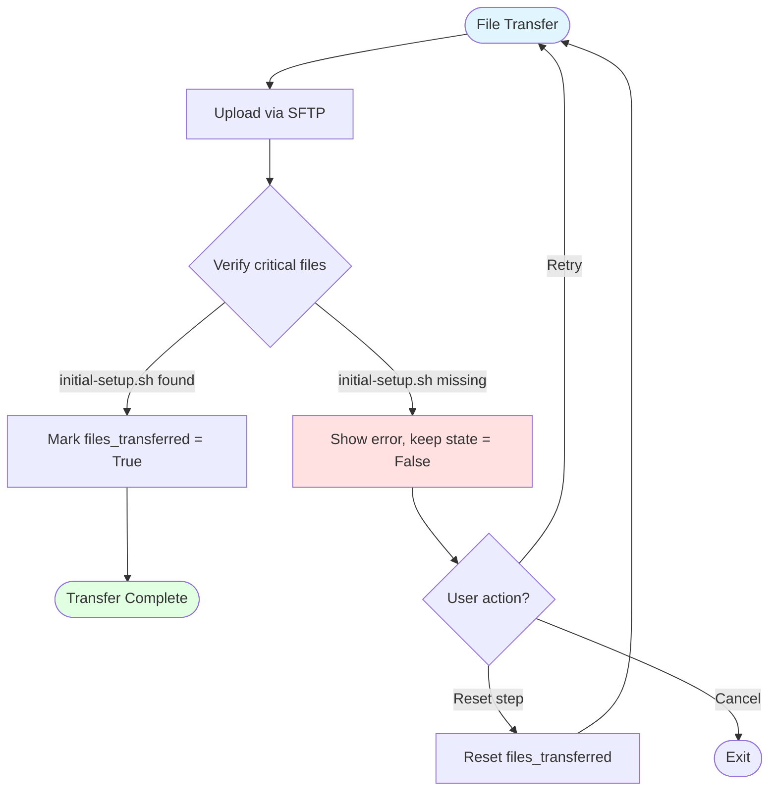

### State Recovery Menu

**Location**: Setup Menu in `main.py`

Three recovery options available:

#### 1. Retry File Transfer (Option 5)

Retries file transfer without resetting other setup steps.

```python
# What it does:
1. Resets files_transferred state to False
2. Re-uploads all files to Pi
3. Verifies initial-setup.sh exists
4. Marks complete only if verification passes
```

**When to use**:
- Bootstrap fails with "initial-setup.sh not found"
- State shows files_transferred=True but files missing
- You suspect transfer was interrupted

#### 2. Reset Individual Step (Option 6)

Interactive menu to reset specific setup steps.

```python
# Available steps:
1. info_gathered
2. ssh_keys_generated
3. files_transferred
4. bootstrap_complete
5. setup_complete
```

**When to use**:
- Need to retry one step without losing other progress
- Want to re-run specific part of setup
- Troubleshooting specific stage failure

#### 3. Reset All Setup State (Option 7)

Resets entire setup state (all steps back to False).

```python
# What it does:
1. Clears all setup completion flags
2. Removes all timestamps
3. Resets to default state
```

**When to use**:
- Starting completely fresh setup
- Too many things went wrong
- Testing setup process

### Session Logging for Debugging

**Location**: `logs/YYYYMMDD-HHMMSS.log`

Every session is logged with:
- Menu selections
- SSH commands and output
- File transfers
- State changes
- Exceptions with stack traces

**Example log for file transfer issue**:

```
[2025-11-18 10:15:23.456] [MENU] Setup Menu -> Choice: 1 (Quick Setup)
[2025-11-18 10:15:24.123] [INFO] Checking setup state...
[2025-11-18 10:15:24.234] [STATE:CHECK] files_transferred = True
[2025-11-18 10:15:24.345] [INFO] Files already transferred (skipping)
[2025-11-18 10:15:25.456] [SSH] SUCCESS: cd ~/pihole-network-manager && bash initial-setup.sh
[2025-11-18 10:15:25.567] [SSH:STDERR]   bash: initial-setup.sh: No such file or directory
[2025-11-18 10:15:25.678] [ERROR] Bootstrap failed
[2025-11-18 10:15:26.789] [MENU] Offering automatic retry to user
```

**How to share logs for support**:
```bash
# Logs are in project root
ls logs/
# → 20251118-101523.log

# Share the most recent log
# Contains full troubleshooting context
```

### Recovery Decision Tree

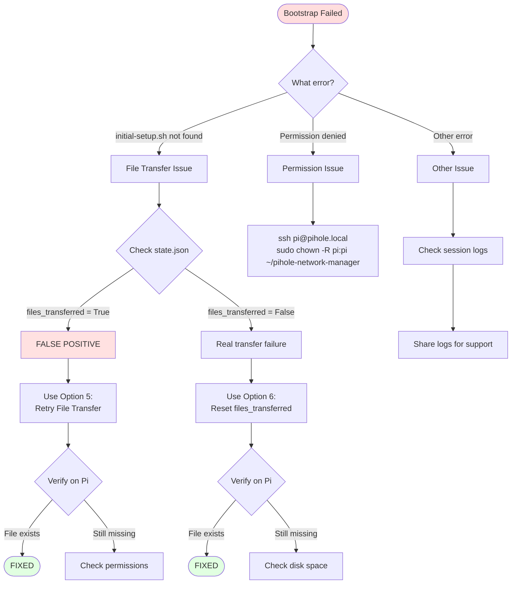

### Verification Commands

After recovery, verify files are present:

```bash
# Check if initial-setup.sh exists
ssh pi@pihole.local "ls -la ~/pihole-network-manager/initial-setup.sh"

# Should show:
# -rwxr-xr-x 1 pi pi 1234 Nov 18 10:15 initial-setup.sh

# Verify all setup files
ssh pi@pihole.local "ls -la ~/pihole-network-manager/"

# Should show:
# initial-setup.sh
# setup.py
# setup/ (directory with all modules)
# config.yaml
```

---

## Router Issues

### Router Connection Troubleshooting Tree

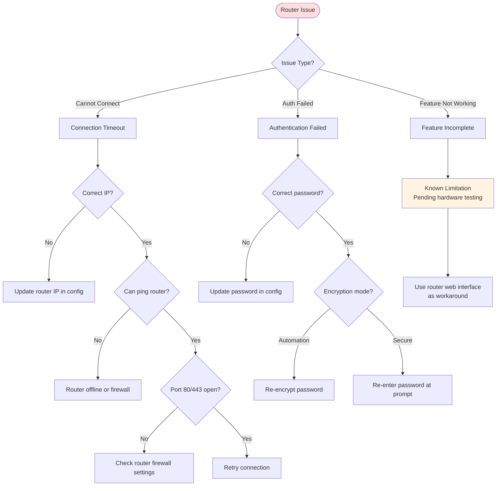

### Router Issue Reference Table

| Issue | Cause | Fix | Severity | Known Limitation |
|-------|-------|-----|----------|------------------|
| **Connection Timeout** | Router IP wrong or offline | Verify router IP and password | Medium | ❌ |
| **Authentication Failed** | Wrong password | Update password in config | Medium | ❌ |
| **Features Incomplete** | Pending hardware testing | Use web interface workaround | Low | ✅ |

### Router Resolution Procedures

#### Issue: Router Authentication Failed

```bash
# Verify router IP
ping 192.168.1.1  # Use your router IP

# Update password in management tool
./pihole-manager.py
# → Router Control
# → Enter new password when prompted

# OR for automation mode, re-encrypt
ssh pi@pihole.local "
    cd ~/pihole-network-manager &&
    python3 -c 'from management.router_control import encrypt_password; encrypt_password(\"YOUR_PASSWORD\")'
"
```

---

## Content Filter Issues

### Content Filter Troubleshooting Tree

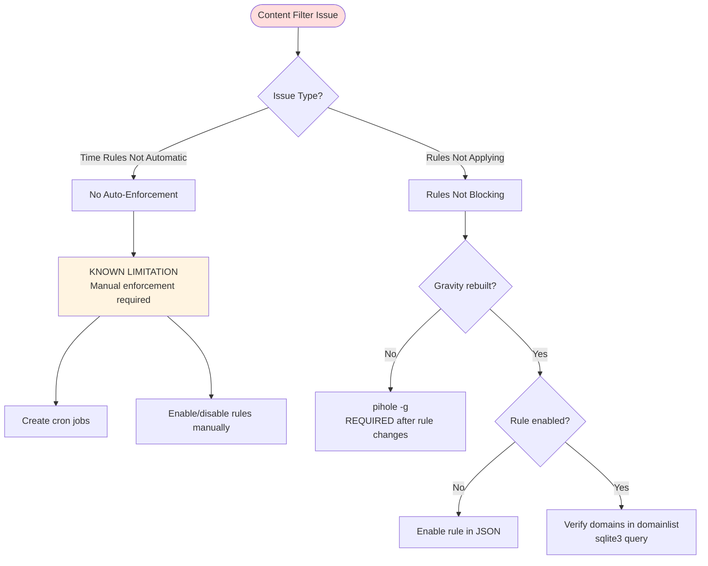

### Content Filter Issue Reference Table

| Issue | Cause | Fix | Severity | Known Limitation |
|-------|-------|-----|----------|------------------|
| **Time Rules Not Automatic** | Manual enforcement required | Create cron jobs or toggle manually | Medium | ✅ |
| **Rules Not Applying** | Gravity not rebuilt | Run `pihole -g` after changes | Medium | ❌ |

### Content Filter Resolution Procedures

#### Issue: Time-Based Rules Not Enforcing Automatically

**KNOWN LIMITATION**: Schedules are stored but NOT enforced automatically.

**Workaround 1 - Manual Toggle**:
```bash
# Via management tool
./pihole-manager.py
# → Content Filtering
# → Toggle Rule On/Off
```

**Workaround 2 - Cron Jobs**:
```bash
# Create cron jobs for automated enforcement
crontab -e

# Add entries (example: block social media 9 AM - 5 PM weekdays)
0 9 * * 1-5 ~/pihole-network-manager/enable_rule.sh social_media
0 17 * * 1-5 ~/pihole-network-manager/disable_rule.sh social_media
```

#### Issue: Rules Created But Not Blocking

```bash
# Check if rule is enabled
cat ~/pihole-network-manager/content_filter_rules.json | jq '.[] | select(.name=="RULE_NAME") | .enabled'

# Rebuild gravity (CRITICAL STEP)
ssh pi@pihole.local "sudo pihole -g"

# Verify domains added to domainlist
ssh pi@pihole.local "sudo sqlite3 /etc/pihole/gravity.db 'SELECT domain FROM domainlist WHERE type=1;'"

# Test blocking
dig @pihole.local facebook.com
# Should return 0.0.0.0 if blocked
```

---

## Backup/Restore Issues

### Backup Failure Troubleshooting Tree

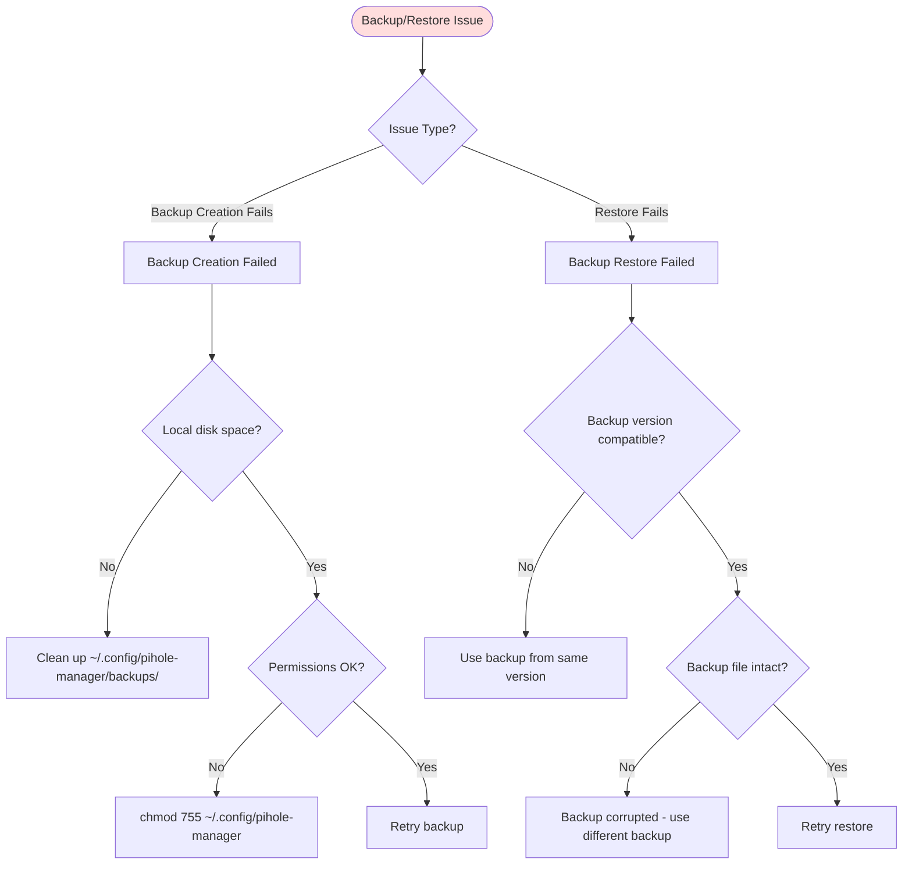

### Backup/Restore Resolution Procedures

#### Issue: Backup Creation Fails

```bash
# Check local disk space
df -h ~/.config/pihole-manager/

# Clean up old backups if needed
ls -lh ~/.config/pihole-manager/backups/
rm ~/.config/pihole-manager/backups/old_backup.tar.gz

# Check permissions
ls -ld ~/.config/pihole-manager

# Create backup via management tool
./pihole-manager.py
# → Backup & Restore
# → Create Backup
```

#### Issue: Backup Restore Fails

```bash
# Check backup file integrity
tar -tzf backup.tar.gz

# If corrupted, use different backup
ls -lh ~/.config/pihole-manager/backups/

# Restore via management tool
./pihole-manager.py
# → Backup & Restore
# → Restore from Backup
# → Select compatible backup file
```

---

## Network Issues

### Network Troubleshooting Tree

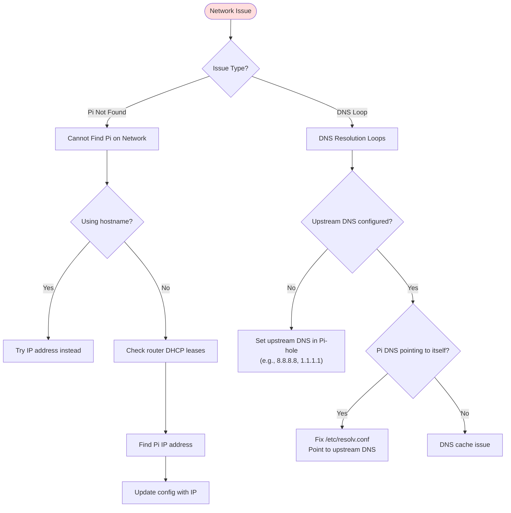

### Network Resolution Procedures

#### Issue: Pi Not Found on Network

```bash
# Check router DHCP leases
# (Access router web interface)

# Find Pi by MAC address
# OR ping broadcast
ping -b 192.168.1.255

# Try using IP instead of hostname
ssh pi@192.168.1.100  # Replace with actual IP

# Update config with IP
# Edit ~/.config/pihole-manager/config.yaml
# Change host: pihole.local → host: 192.168.1.100
```

#### Issue: DNS Resolution Loops

```bash
# Check Pi-hole upstream DNS
ssh pi@pihole.local "cat /etc/pihole/setupVars.conf | grep PIHOLE_DNS"

# Should show upstream DNS like:
# PIHOLE_DNS_1=8.8.8.8
# PIHOLE_DNS_2=1.1.1.1

# If not configured, set via web interface or reconfigure
ssh pi@pihole.local "sudo pihole -r"

# Fix /etc/resolv.conf on Pi
ssh pi@pihole.local "cat /etc/resolv.conf"
# Should NOT be: nameserver 127.0.0.1

# Fix if needed
ssh pi@pihole.local "
    sudo sh -c 'echo nameserver 8.8.8.8 > /etc/resolv.conf'
"
```

---

## Diagnostic Commands Quick Reference

### SSH Diagnostics

```bash
# Test SSH connection
ssh -v pi@pihole.local

# Check SSH key permissions
ls -l ~/.ssh/pihole_ed25519

# Regenerate host key (if changed)
ssh-keygen -R pihole.local
```

### Pi-hole Diagnostics

```bash
# Pi-hole status
pihole status

# Check FTL service
systemctl status pihole-FTL

# DNS test
dig @localhost google.com

# Database integrity
sqlite3 /etc/pihole/gravity.db "PRAGMA integrity_check;"

# View logs
journalctl -u pihole-FTL -n 50
```

### Network Diagnostics

```bash
# Ping Pi
ping pihole.local

# DNS lookup
nslookup google.com pihole.local

# Port check
nc -zv pihole.local 53

# Traceroute
traceroute pihole.local
```

---

## Common Error Messages

| Error Message | Meaning | Solution |
|---------------|---------|----------|
| `Permission denied (publickey)` | SSH key issue | Check key permissions (600) |
| `Host key verification failed` | Host key changed | `ssh-keygen -R hostname` |
| `ModuleNotFoundError: No module named 'paramiko'` | Dependencies not installed | `pip install -r requirements.txt` |
| `[Errno 111] Connection refused` | Service not running | `systemctl start pihole-FTL` |
| `sqlite3.OperationalError: database is locked` | Another process accessing DB | Wait or stop conflicting process |
| `No space left on device` | Disk full | Clean up with `apt clean`, `apt autoremove` |

---

## References

- **KDL File**: `.claude/knowledge/troubleshooting.kd`
- **Health Check**: `docs/health-check.md`
- **Deployment Guide**: `docs/deployment-guide.md`

---

## Getting Help

If issues persist after following this guide:

1. Check logs: `journalctl -u pihole-FTL -n 100`
2. Run health check: `python3 health_check.py`
3. Create GitHub issue with:
   - Error message
   - Steps to reproduce
   - Logs (sanitized)
   - Environment details
